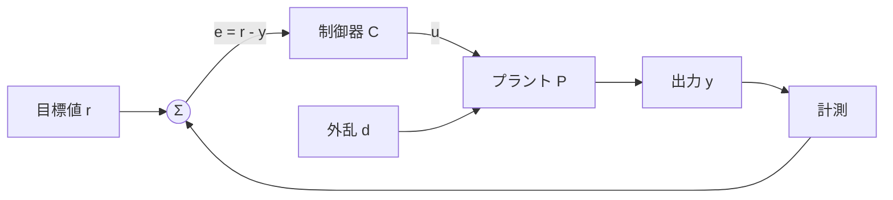
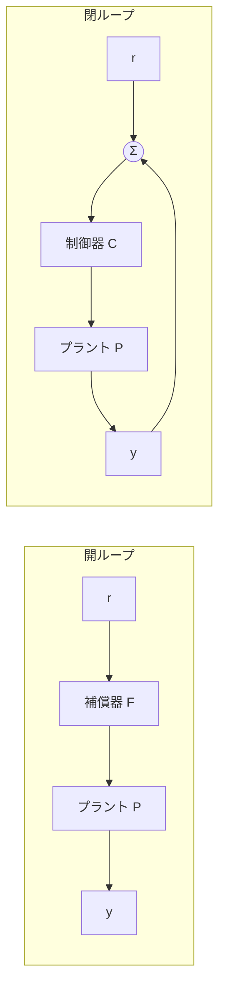
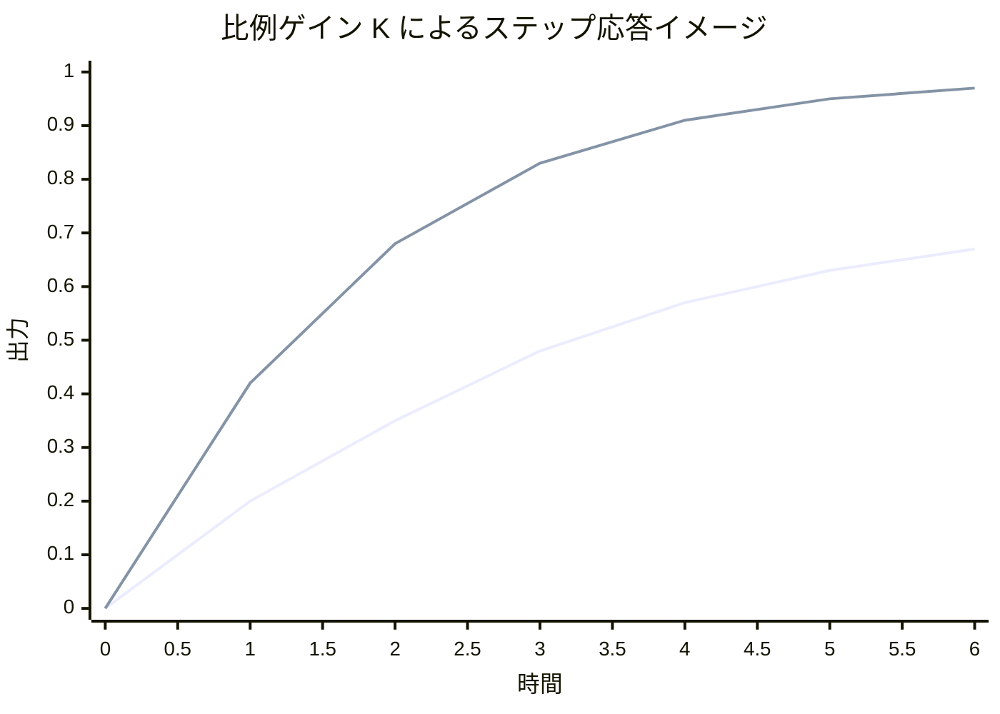

# 第1回 制御とは何か

## 1. 導入（なぜこの概念が必要か）

制御とは、対象の振る舞いを望ましいものに調整するための理論と技術である。工学では、単に「動かす」だけでは足りない。外乱が加わっても壊れず、目標値に近づき、必要以上に振動せず、しかも速く応答することが求められる。この複数の要求を同時に扱うために制御理論が必要になる。

歴史的には、蒸気機関の回転速度を一定に保つワットの遠心ガバナが、フィードバック制御の代表例として知られている。ここで重要なのは、「出力を測って、その結果を入力の決定に戻す」という発想である。これがフィードバックである。制御理論の嬉しさは、対象が多少不確かでも、測定した結果を使って振る舞いを修正できる点にある。

古典制御理論は、主として単入力単出力系を対象に、伝達関数、周波数応答、安定判別などを用いて設計する。その最初の入り口が「制御とは何か」の理解である。本講義では次の問いに答える。

- なぜ開ループだけでは不十分なのか
- なぜ閉ループにすると外乱や不確かさに強くなりうるのか
- 制御の目的である安定化と追従とは何を意味するのか

この回で得たい気持ちは明快である。すなわち、「出力を見ながら入力を調整することが、単なる経験則ではなく、数式で意味づけられた強力な道具である」と納得することである。

## 2. 理論本体

### 2.1 制御系の基本構成

制御対象をプラント $P$、制御器を $C$、目標値を $r$、出力を $y$、操作量を $u$、外乱を $d$、観測雑音を $n$ とする。

まず、開ループ制御では、入力 $u$ は目標値 $r$ のみから決まり、出力 $y$ は入力の結果として生じるが、その $y$ 自体は入力決定に使われない。抽象的には

$$
u = F r, \qquad y = P u + d
$$

のように書ける。ここで $F$ は前向き補償器である。

一方、閉ループ制御では、出力を参照して誤差

$$
e = r - y_m
$$

を作り、その誤差から入力を決める。ここで測定出力 $y_m$ を

$$
y_m = y + n
$$

とする。最も基本的な負帰還系では

$$
u = C e = C(r - y_m) = C(r - y - n)
$$

である。

以下ではまず雑音を無視して $n = 0$ とし、外乱 $d$ はプラント出力側に加わるものとする。すると

$$
y = P u + d
$$

および

$$
u = C(r - y)
$$

であるから、

$$
y = P C(r - y) + d
$$

となる。右辺を展開すると

$$
y = P C r - P C y + d
$$

したがって、$y$ を左辺に集めて

$$
(1 + P C) y = P C r + d
$$

を得る。よって

$$
y = \frac{P C}{1 + P C} r + \frac{1}{1 + P C} d
$$

である。

ここで

$$
T = \frac{P C}{1 + P C}
$$

を相補感度関数、また

$$
S = \frac{1}{1 + P C}
$$

を感度関数と呼ぶ。すると

$$
y = T r + S d
$$

と書ける。

### 2.2 基本構成の図

この図は、閉ループ制御の最も基本的な信号の流れを表している。目標値 $r$ と出力 $y$ の差が誤差 $e$ となり、その誤差に応じて制御器 $C$ が操作量 $u$ を生成する。プラント $P$ に外乱 $d$ が入っても、その結果が再び測定されて入力決定に反映される点が、開ループとの決定的な違いである。

### 2.3 フィードバックの意味

上式は、フィードバックの意味を非常に明快に示している。目標値 $r$ から出力 $y$ への伝達は $T$、外乱 $d$ から出力 $y$ への伝達は $S$ である。したがって、ループゲイン $P C$ の大きさが十分大きい周波数領域では、

$$
|1 + P C| \gg 1
$$

となり、

$$
|S| = \left| \frac{1}{1 + P C} \right| \ll 1
$$

となる。これは、その周波数帯域では外乱の影響が小さく抑えられることを意味する。

また、同じ条件の下で

$$
T = \frac{P C}{1 + P C} \approx 1
$$

となるので、出力は目標値によく追従する。これがフィードバックの工学的な嬉しさである。

### 2.4 開ループと閉ループの比較

#### 定義 1（開ループ制御）

出力情報を入力決定に用いない制御を開ループ制御という。

#### 定義 2（閉ループ制御）

出力または出力に関する情報を入力決定に用いる制御を閉ループ制御という。

開ループ制御では、たとえば

$$
u = F r
$$

としたとき、

$$
y = P F r + d
$$

である。ここでは外乱 $d$ がそのまま出力に現れる。さらに、プラント $P$ のモデルがずれると、そのずれが直接性能劣化に結びつく。

これに対し閉ループ制御では

$$
y = \frac{P C}{1 + P C} r + \frac{1}{1 + P C} d
$$

であり、$1 + P C$ が分母に現れる。したがって、適切にループゲインを持たせれば、外乱抑制やモデル誤差への感度低減が期待できる。

ただし、閉ループには代償もある。分母 $1 + P C$ がゼロになるような振る舞いが起これば、かえって不安定になる。このため、フィードバックは万能ではなく、「安定を保ちながら性能を得る」ことが本質的課題になる。

### 2.5 開ループと閉ループの模式図

この図では、開ループでは出力 $y$ が入力形成に戻っていないのに対し、閉ループでは $y$ が誤差生成に戻されていることが一目で分かる。理論上の差は分母に $1 + PC$ が現れるかどうかであり、図の差は「戻り経路があるかどうか」である。図と式が対応していることが重要である。

### 2.6 安定化

制御の第一目的は安定化である。直感的には、初期ずれや外乱に対して応答が発散せず、時間が経つと落ち着くことである。

古典制御でまず扱う連続時間線形時不変系では、伝達関数の極が複素平面の左半平面にあるとき、内部の自由応答が減衰する。したがって、閉ループ系の極を左半平面に置くことが安定化の基本方針となる。

厳密な極の議論は第3回以降で扱うが、この回では次の考え方を押さえればよい。

- 不安定な対象でも、フィードバックによって安定化できる場合がある
- 逆に、安定な対象でも、不適切なフィードバックで不安定化することがある

したがって制御とは、単に誤差を小さくする操作ではなく、安定性という制約のもとで振る舞いを設計する行為である。

### 2.7 追従

制御の第二目的は追従である。目標値 $r$ が与えられたとき、出力 $y$ がそれに近づくことをいう。

誤差を

$$
e = r - y
$$

とする。雑音を無視し、出力側外乱 $d$ もひとまず $0$ とすれば、

$$
y = \frac{P C}{1 + P C} r
$$

なので、

$$
e = r - \frac{P C}{1 + P C} r
$$

である。分母をそろえると

$$
e = \frac{1 + P C}{1 + P C} r - \frac{P C}{1 + P C} r
$$

よって

$$
e = \frac{1}{1 + P C} r = S r
$$

となる。したがって、追従誤差も感度関数 $S$ によって決まる。ループゲインが大きければ誤差が小さくなる、という理解がここでも現れる。

ただし、全ての周波数でループゲインを無限に大きくすることはできない。高周波では雑音増幅や不安定化の危険がある。この制約の中で、どの周波数帯域で追従性を良くし、どこでロバスト性を確保するかが設計になる。

### 2.8 命題と簡単な証明

#### 命題 1

単位負帰還系

$$
u = C(r - y), \qquad y = P u + d
$$

において、目標値 $r$ から出力 $y$ への伝達関数は

$$
\frac{Y}{R} = \frac{P C}{1 + P C}
$$

であり、外乱 $d$ から出力 $y$ への伝達関数は

$$
\frac{Y}{D} = \frac{1}{1 + P C}
$$

である。

#### 証明

まず

$$
u = C(r - y)
$$

であるから、

$$
y = P u + d = P C(r - y) + d
$$

となる。これを展開すると

$$
y = P C r - P C y + d
$$

である。$y$ を左辺に集めて

$$
y + P C y = P C r + d
$$

すなわち

$$
(1 + P C) y = P C r + d
$$

を得る。両辺を $1 + P C$ で割ると

$$
y = \frac{P C}{1 + P C} r + \frac{1}{1 + P C} d
$$

である。よって係数比較により結論を得る。証明終。

## 3. 直感的理解

### 3.1 幾何学的解釈

フィードバックとは、「現在の位置と目標位置との差」を見て、進む方向と大きさを決める仕組みだと理解できる。誤差 $e = r - y$ が大きければ大きく操作し、誤差が小さければ操作を弱める。したがって、誤差をゼロへ押し戻す力が系に入る。

### 3.2 物理的意味

室温制御を考える。部屋の温度を $y$、設定温度を $r$ とする。外気温の変動や窓の開閉は外乱 $d$ に相当する。開ループでヒータ出力を固定すると、外気の変化に応じて室温は簡単にずれる。一方、閉ループで温度計の値を見てヒータを調整すれば、寒くなったときは自動で加熱を強め、暑くなったときは弱められる。これが外乱抑制である。

### 3.3 設計視点からの解釈

設計者の視点では、フィードバックは次の3つの役割をもつ。

- 目標値への追従を良くする
- 外乱の影響を小さくする
- モデルのずれに対して頑健にする

しかし同時に、ループを強くしすぎると振動や不安定化の危険が増す。したがって、「大きければよい」ではなく、「安定余裕を残して十分大きくする」が正しい態度である。

### 3.4 よくある誤解

- フィードバックをかければ必ず安定になる、という理解は誤りである
- 誤差を速く消そうとするほど常に良い、という理解も誤りである
- 開ループ制御は古いから無意味、という理解も誤りである

最後の点について補足する。対象モデルが非常に正確で、外乱が小さく、計測が困難な場合には、開ループ制御が有効なこともある。重要なのは、どの不確かさに備えたいかである。

## 4. 具体例

### 4.1 一次系の速度制御

プラントを

$$
P(s) = \frac{1}{s + 1}
$$

とする。これは時定数 $1$ の一次遅れ系である。制御器として比例制御

$$
C(s) = K
$$

を用いる。

このとき閉ループ伝達関数は

$$
T(s) = \frac{P(s)C(s)}{1 + P(s)C(s)}
$$

であるから、

$$
T(s) = \frac{\frac{K}{s+1}}{1 + \frac{K}{s+1}}
$$

分母を通分すると

$$
1 + \frac{K}{s+1} = \frac{s+1+K}{s+1}
$$

よって

$$
T(s) = \frac{\frac{K}{s+1}}{\frac{s+1+K}{s+1}} = \frac{K}{s+1+K}
$$

となる。

この式から、閉ループ極は

$$
s = -(1+K)
$$

である。したがって $K > -1$ なら極は左半平面にある。特に $K > 0$ とすれば、$K$ を大きくするほど極は左へ移動し、応答は速くなる。

### 4.2 応答イメージの図

この図は厳密な数値計算結果そのものではなく、比例ゲイン $K$ を大きくすると立ち上がりが速くなり、目標値により近づきやすくなるという傾向を視覚化した模式図である。ここで大事なのは、応答速度の改善と引き換えに、実際にはノイズ感度や不安定化の危険も増えうるという点である。

### 4.3 定常値の確認

単位ステップ目標値

$$
r(t) = 1 \quad (t \ge 0)
$$

に対してラプラス像は

$$
R(s) = \frac{1}{s}
$$

である。よって

$$
Y(s) = T(s)R(s) = \frac{K}{s+1+K} \cdot \frac{1}{s}
$$

となる。最終値定理が適用できるとすると、

$$
\lim_{t \to \infty} y(t) = \lim_{s \to 0} sY(s)
$$

したがって

$$
\lim_{t \to \infty} y(t) = \lim_{s \to 0} \frac{K}{s+1+K} = \frac{K}{1+K}
$$

である。よって定常偏差 $e_\infty$ は

$$
e_\infty = 1 - \frac{K}{1+K} = \frac{1}{1+K}
$$

となる。$K$ を大きくすると定常偏差は小さくなるが、ゼロにはならない。これが比例制御だけの限界であり、第12回の PID 制御へつながる重要な観察である。

### 4.4 外乱の影響

同じ系で出力側外乱 $d$ を考えると、

$$
S(s) = \frac{1}{1 + P(s)C(s)} = \frac{1}{1 + \frac{K}{s+1}}
$$

であるから、

$$
S(s) = \frac{s+1}{s+1+K}
$$

となる。低周波、特に $s \approx 0$ に注目すると

$$
S(0) = \frac{1}{1+K}
$$

である。したがって、ゆっくりした外乱に対しては $K$ を大きくするほど影響を抑えられる。

### 4.5 図の言語的説明

図を見ながら振る舞いを言葉で説明する。開ループでは、ステップ目標値を入れても出力は単に前向き要素の設定どおりに動くだけで、途中でずれても自分では修正できない。閉ループでは、目標に届いていない間は誤差が残るため操作が続き、目標に近づくほど操作が弱まる。また、応答図では比例ゲイン $K$ を上げると立ち上がりは速くなる様子が見えるが、実際の設計ではその裏側にある安定余裕の低下も考えなければならない。

## 5. 演習問題（3〜5問）

### 問1（★）

単位負帰還系

$$
u = C(r-y), \qquad y = Pu
$$

において、目標値 $r$ から出力 $y$ への伝達関数を導出せよ。

### 問2（★）

開ループ制御と閉ループ制御の違いを、外乱抑制とモデル誤差の観点から 150 字程度で説明せよ。

### 問3（★★）

プラント

$$
P(s)=\frac{1}{s+2}
$$

に対し、比例制御器

$$
C(s)=K
$$

を用いた単位負帰還系の閉ループ伝達関数を求めよ。また、閉ループ極を求め、$K>0$ のとき安定であることを確認せよ。

### 問4（★★）

問3の系に単位ステップ入力を加えたときの定常偏差を求めよ。

### 問5（★★★）

閉ループ系で感度関数

$$
S=\frac{1}{1+PC}
$$

が小さいことの意味を、追従誤差と外乱抑制の両面から数式を用いて説明せよ。

## 6. 演習解答解説

### 問1 解答

与えられた式は

$$
u = C(r-y)
$$

および

$$
y = Pu
$$

である。第2式に第1式を代入すると

$$
y = P C(r-y)
$$

である。右辺を展開して

$$
y = P C r - P C y
$$

となる。$y$ を左辺に集めると

$$
y + P C y = P C r
$$

したがって

$$
(1+PC)y = PCr
$$

である。よって

$$
\frac{Y}{R} = \frac{PC}{1+PC}
$$

を得る。

つまずきやすい点は、$P$ や $C$ を単なる数ではなく伝達関数として扱っていることである。ただし線形時不変系ではブロック線図上、代数的に同じ形で整理できる。

### 問2 解答

開ループ制御は出力を見ずに入力を決めるため、外乱が入るとその影響を自動では打ち消せず、モデル誤差にも弱い。閉ループ制御は出力と目標値の差を用いて入力を更新するので、誤差が生じるとそれを減らす方向に自動補正が働く。その結果、外乱抑制や不確かさへの頑健性を得やすいが、設計を誤ると不安定化しうる。

### 問3 解答

まず

$$
P(s)C(s)=\frac{K}{s+2}
$$

である。したがって閉ループ伝達関数は

$$
T(s)=\frac{PC}{1+PC}
=\frac{\frac{K}{s+2}}{1+\frac{K}{s+2}}
$$

である。分母を通分して

$$
1+\frac{K}{s+2}=\frac{s+2+K}{s+2}
$$

となるので

$$
T(s)=\frac{\frac{K}{s+2}}{\frac{s+2+K}{s+2}}=\frac{K}{s+2+K}
$$

を得る。

閉ループ極は分母

$$
s+2+K=0
$$

の根であるから

$$
s=-(2+K)
$$

である。$K>0$ なら $2+K>0$ なので、極は常に左半平面にあり安定である。

### 問4 解答

単位ステップ入力に対して

$$
R(s)=\frac{1}{s}
$$

である。したがって

$$
Y(s)=T(s)R(s)=\frac{K}{s+2+K}\cdot\frac{1}{s}
$$

となる。定常値は最終値定理より

$$
\lim_{t\to\infty}y(t)=\lim_{s\to 0}sY(s)=\lim_{s\to 0}\frac{K}{s+2+K}=\frac{K}{2+K}
$$

である。したがって定常偏差は

$$
e_\infty=1-\frac{K}{2+K}=\frac{2}{2+K}
$$

となる。

ここでのポイントは、「偏差」は $1-y(\infty)$ であることを忘れないことである。出力の定常値を求めて終わりにしてしまう誤りが多い。

### 問5 解答

まず追従誤差について述べる。外乱を無視して $d=0$ とすると、

$$
y=\frac{PC}{1+PC}r
$$

であるから、

$$
e=r-y=r-\frac{PC}{1+PC}r
$$

である。分母をそろえると

$$
e=\frac{1+PC}{1+PC}r-\frac{PC}{1+PC}r=\frac{1}{1+PC}r=Sr
$$

となる。したがって $|S|$ が小さいほど、同じ目標値入力に対して誤差は小さい。

次に外乱抑制について述べる。目標値を $r=0$ として外乱のみを考えると、

$$
y=\frac{1}{1+PC}d=Sd
$$

である。したがって $|S|$ が小さいほど、同じ外乱に対して出力への影響も小さい。

以上より、感度関数 $S$ が小さいとは、「誤差に敏感でない」のではなく、「目標値に対する残差と外乱の影響が小さく抑えられている」ことを意味する。設計上は、この小ささを必要な周波数帯域で実現することが重要である。

## 7. まとめ

この回で得た武器は次の3つである。

- 制御の中心課題は、安定化と追従であるという視点
- 開ループと閉ループの違いを、式 $y = \frac{PC}{1+PC}r + \frac{1}{1+PC}d$ で説明できること
- 感度関数 $S$ と相補感度関数 $T$ により、追従と外乱抑制の意味を整理できること

次回はラプラス変換を導入する。今回用いた $P(s)$ や $C(s)$ という表現は、時間領域の微分方程式を周波数・複素数の世界に写した結果である。次回の内容によって、今日の式変形が単なる記号操作ではなく、系統的な解析手法として理解できるようになる。
