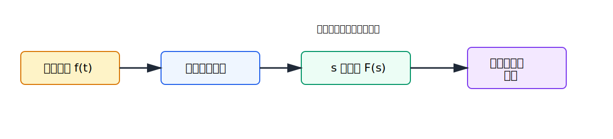
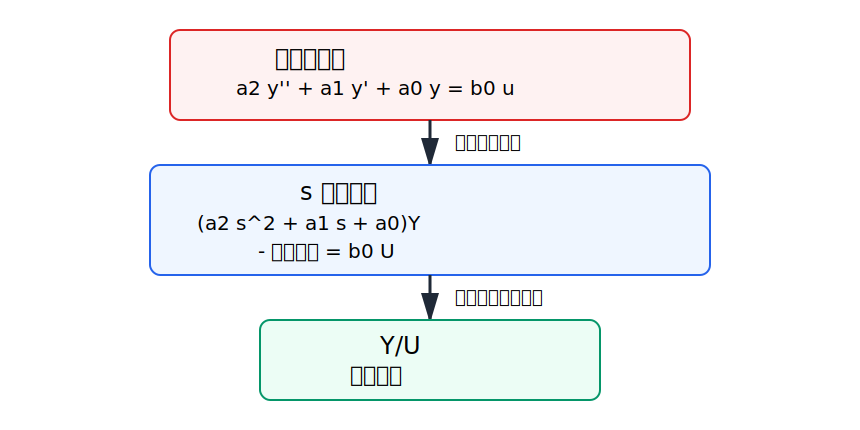
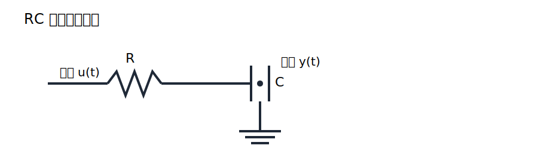
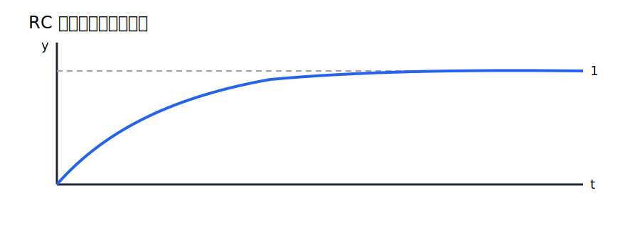

# 第2回 ラプラス変換

## 1. 導入（なぜこの概念が必要か）

制御対象の多くは、時間 $t$ に関する微分方程式で記述される。たとえば質量ばねダンパ系、電気回路、熱系、流体系は、入力と出力の関係が微分方程式として与えられる。しかし、微分方程式を時間領域でそのまま扱うと、合成、安定性、応答の比較が煩雑になりやすい。

そこで導入されるのがラプラス変換である。ラプラス変換の嬉しさは、微分を代数演算に変換できる点にある。時間領域では

$$
\frac{d}{dt}
$$

という微分作用素が、複素数変数 $s$ の世界では概ね

$$
s
$$

の掛け算に置き換わる。この変換によって、微分方程式が代数方程式になり、制御系の解析と設計が飛躍的に整理される。

古典制御理論では、前回扱った閉ループ伝達関数

$$
T(s) = \frac{P(s)C(s)}{1 + P(s)C(s)}
$$

のような表現が中心になる。この $P(s)$ や $C(s)$ は、まさにラプラス変換を通して得られる。本講義の意味は明快である。すなわち、「なぜ制御で $s$ を使うのか」「なぜ微分方程式が分数式になるのか」を、計算規則だけでなく論理として理解することである。

## 2. 理論本体

### 2.1 定義

#### 定義 1（ラプラス変換）

関数 $f(t)$ に対し、積分

$$
\int_0^\infty e^{-st} f(t)\,dt
$$

が収束するとき、その値を $f(t)$ のラプラス変換といい、

$$
\mathcal{L}\{f(t)\}(s) = F(s)
$$

または

$$
F(s) = \int_0^\infty e^{-st} f(t)\,dt
$$

と書く。

ここで $s$ は複素変数であり、

$$
s = \sigma + j\omega
$$

と表される。$e^{-st}$ は

$$
e^{-st} = e^{-\sigma t} e^{-j\omega t}
$$

と分解されるので、$\sigma$ は減衰、$\omega$ は振動の情報に対応する。

### 2.2 基本図

この図は、ラプラス変換が単なる記号変換ではなく、時間領域の現象を複素領域へ写し、そこで解析した結果を再び時間領域へ戻す橋渡しであることを表している。制御ではこの往復が重要であり、$s$ 領域の式の意味は最終的に時間応答へ帰着する。

### 2.3 線形性

#### 命題 1（線形性）

定数 $a,b$ と関数 $f(t),g(t)$ に対し、両辺のラプラス変換が存在するとき、

$$
\mathcal{L}\{a f(t) + b g(t)\}
= a \mathcal{L}\{f(t)\} + b \mathcal{L}\{g(t)\}
$$

が成り立つ。

#### 証明

定義に従って、

$$
\mathcal{L}\{a f(t) + b g(t)\}
= \int_0^\infty e^{-st}(a f(t) + b g(t))\,dt
$$

である。積分の線形性より

$$
\int_0^\infty e^{-st}(a f(t) + b g(t))\,dt
= a \int_0^\infty e^{-st}f(t)\,dt + b \int_0^\infty e^{-st}g(t)\,dt
$$

となる。右辺は定義により

$$
a \mathcal{L}\{f(t)\} + b \mathcal{L}\{g(t)\}
$$

である。よって示された。証明終。

### 2.4 基本関数の変換

まず最も基本的な例を確認する。

#### 例 1

$$
f(t) = 1
$$

とする。このとき

$$
F(s) = \int_0^\infty e^{-st}\,dt
$$

である。$s$ の実部が正であるとき、

$$
\int_0^\infty e^{-st}\,dt
= \left[ -\frac{1}{s}e^{-st} \right]_0^\infty
$$

となる。$\operatorname{Re}(s) > 0$ なら

$$
\lim_{t\to\infty} e^{-st} = 0
$$

であるから、

$$
\left[ -\frac{1}{s}e^{-st} \right]_0^\infty
= 0 - \left(-\frac{1}{s}\right)
= \frac{1}{s}
$$

よって

$$
\mathcal{L}\{1\} = \frac{1}{s}, \qquad \operatorname{Re}(s) > 0
$$

である。

#### 例 2

$$
f(t) = e^{-at}
$$

とする。このとき

$$
F(s) = \int_0^\infty e^{-st}e^{-at}\,dt
= \int_0^\infty e^{-(s+a)t}\,dt
$$

である。例 1 と同様にして

$$
\mathcal{L}\{e^{-at}\} = \frac{1}{s+a}
$$

を得る。

#### 例 3

$$
f(t) = t
$$

とする。このとき部分積分を用いる。$u=t$, $dv=e^{-st}dt$ と置けば

$$
du=dt, \qquad v=-\frac{1}{s}e^{-st}
$$

である。したがって

$$
\int_0^\infty t e^{-st}\,dt
= \left[-\frac{t}{s}e^{-st}\right]_0^\infty + \frac{1}{s}\int_0^\infty e^{-st}\,dt
$$

である。$\operatorname{Re}(s)>0$ のとき第1項は $0$ なので、

$$
\int_0^\infty t e^{-st}\,dt
= \frac{1}{s}\cdot \frac{1}{s}
= \frac{1}{s^2}
$$

よって

$$
\mathcal{L}\{t\} = \frac{1}{s^2}
$$

である。

### 2.5 微分のラプラス変換

#### 定理 1

$f(t)$ が区分的に連続で、$f'(t)$ のラプラス変換が存在するとき、

$$
\mathcal{L}\{f'(t)\} = sF(s) - f(0)
$$

が成り立つ。

#### 証明

定義より

$$
\mathcal{L}\{f'(t)\}
= \int_0^\infty e^{-st} f'(t)\,dt
$$

である。部分積分を用いる。$u=e^{-st}$, $dv=f'(t)dt$ と置けば

$$
du=-s e^{-st}dt, \qquad v=f(t)
$$

である。よって

$$
\int_0^\infty e^{-st} f'(t)\,dt
= \left[e^{-st}f(t)\right]_0^\infty - \int_0^\infty f(t)(-s e^{-st})\,dt
$$

したがって

$$
\int_0^\infty e^{-st} f'(t)\,dt
= \left[e^{-st}f(t)\right]_0^\infty + s\int_0^\infty e^{-st}f(t)\,dt
$$

ここで、適切な収束条件の下で

$$
\lim_{t\to\infty} e^{-st}f(t)=0
$$

なので、

$$
\left[e^{-st}f(t)\right]_0^\infty
= 0 - f(0)
= -f(0)
$$

である。ゆえに

$$
\mathcal{L}\{f'(t)\}
= -f(0) + sF(s)
= sF(s) - f(0)
$$

を得る。証明終。

同様に 2 階微分については

$$
\mathcal{L}\{f''(t)\}
= s^2F(s) - s f(0) - f'(0)
$$

が成り立つ。

### 2.6 微分が代数になる図

この図は、微分方程式がラプラス変換によって多項式の掛け算へ変わることを示している。制御で伝達関数が便利なのは、まさにこの変換があるからである。初期値が残ることも図に含めているのは、伝達関数が「ゼロ初期値の入出力関係」であることをはっきり意識するためである。

### 2.7 微分方程式との関係

入力 $u(t)$、出力 $y(t)$ をもつ線形時不変系が

$$
a_n y^{(n)}(t) + a_{n-1} y^{(n-1)}(t) + \cdots + a_1 y'(t) + a_0 y(t)
= b_m u^{(m)}(t) + \cdots + b_1 u'(t) + b_0 u(t)
$$

で与えられているとする。

ゼロ初期値

$$
y(0)=y'(0)=\cdots = y^{(n-1)}(0)=0
$$

および

$$
u(0)=u'(0)=\cdots = u^{(m-1)}(0)=0
$$

を仮定してラプラス変換すると、

$$
a_n s^n Y(s) + a_{n-1}s^{n-1}Y(s) + \cdots + a_1 sY(s) + a_0 Y(s)
$$

$$
= b_m s^m U(s) + \cdots + b_1 sU(s) + b_0 U(s)
$$

である。左辺と右辺でそれぞれ $Y(s)$, $U(s)$ をくくると

$$
\left(a_n s^n + a_{n-1}s^{n-1} + \cdots + a_1 s + a_0\right)Y(s)
$$

$$
= \left(b_m s^m + \cdots + b_1 s + b_0\right)U(s)
$$

となる。したがって、ゼロ初期値のもとでの伝達関数は

$$
G(s) = \frac{Y(s)}{U(s)}
= \frac{b_m s^m + \cdots + b_1 s + b_0}{a_n s^n + a_{n-1}s^{n-1} + \cdots + a_1 s + a_0}
$$

である。

### 2.8 命題

#### 命題 2

ゼロ初期値のもとでは、線形時不変系の微分方程式は $s$ 領域で代数方程式へ変換され、入出力比 $Y(s)/U(s)$ は $s$ の有理関数になる。

#### 証明

上の導出そのものである。各微分項 $y^{(k)}(t)$ はゼロ初期値のもとで

$$
\mathcal{L}\{y^{(k)}(t)\} = s^k Y(s)
$$

となり、入力側も同様である。したがって微分方程式の全ての項は $Y(s)$ または $U(s)$ に $s$ の多項式を掛けた形に変換される。よって整理後の入出力比は、分子・分母がともに $s$ の多項式である分数式、すなわち有理関数となる。証明終。

## 3. 直感的理解

### 3.1 幾何学的解釈

ラプラス変換は、時間波形 $f(t)$ を、そのまま眺める代わりに、指数関数

$$
e^{-st}
$$

との重み付き積分として観察する操作である。異なる $s$ を選ぶと、異なる減衰率・振動数のレンズで信号を観察していることになる。

### 3.2 物理的意味

制御対象が「速く変化する成分」と「ゆっくり変化する成分」を含むとき、時間波形だけでは何が支配的か見えにくい。ラプラス変換を使うと、応答の背後にある減衰モードや振動モードが $s$ の関数として整理される。これは、系がどのような内部モードを持っているかを見る準備でもある。

### 3.3 設計視点からの解釈

設計者にとって大事なのは、微分方程式を解くこと自体ではなく、系を接続したときに何が起きるかを素早く判断できることである。伝達関数があれば、直列接続は掛け算、閉ループは

$$
\frac{PC}{1+PC}
$$

という形で整理できる。その基礎がラプラス変換である。

### 3.4 よくある誤解

- ラプラス変換はただの公式集だ、という理解は誤りである
- $s$ を実数だと思い込むのも誤りである
- 初期値の項を忘れて常に $sF(s)$ だけが出ると思うのも誤りである

特に最後の誤解は重要である。伝達関数を導くときに初期値をゼロと置く理由を意識しないと、何を表す比なのかが曖昧になる。

## 4. 具体例

### 4.1 RC 回路の例

抵抗 $R$、コンデンサ $C$ からなる RC 低域通過回路で、入力電圧を $u(t)$、コンデンサ両端電圧を $y(t)$ とする。回路方程式は

$$
RC \frac{dy(t)}{dt} + y(t) = u(t)
$$

である。

ゼロ初期値 $y(0)=0$ を仮定してラプラス変換すると

$$
RC \left( sY(s) \right) + Y(s) = U(s)
$$

である。よって

$$
(RCs + 1)Y(s) = U(s)
$$

となる。したがって伝達関数は

$$
G(s)=\frac{Y(s)}{U(s)}=\frac{1}{RCs+1}
$$

である。

### 4.2 ステップ入力に対する応答

単位ステップ入力

$$
u(t)=1 \quad (t\ge 0)
$$

に対して

$$
U(s)=\frac{1}{s}
$$

である。したがって

$$
Y(s)=G(s)U(s)=\frac{1}{RCs+1}\cdot \frac{1}{s}
= \frac{1}{s(RCs+1)}
$$

である。

ここで部分分数分解を行う。定数 $A,B$ を用いて

$$
\frac{1}{s(RCs+1)} = \frac{A}{s} + \frac{B}{RCs+1}
$$

と置く。両辺に $s(RCs+1)$ を掛けると

$$
1 = A(RCs+1) + Bs
$$

である。これを整理して

$$
1 = (ARC + B)s + A
$$

となる。係数比較により

$$
A = 1, \qquad ARC + B = 0
$$

したがって

$$
B = -RC
$$

である。よって

$$
Y(s)=\frac{1}{s} - \frac{RC}{RCs+1}
= \frac{1}{s} - \frac{1}{s+\frac{1}{RC}}
$$

となる。逆変換により

$$
y(t)=1-e^{-t/(RC)}
$$

を得る。

### 4.3 RC 回路の模式図

この図は RC 低域通過回路の構成を示している。入力の急激な変化に対して、コンデンサ電圧はすぐには変われないので、出力はなめらかに立ち上がる。この物理的性質が、伝達関数

$$
\frac{1}{RCs+1}
$$

という一次遅れ系の形として現れる。

### 4.4 応答イメージ図

この図から、出力は単調に増加して目標値 $1$ に近づくが、有限時間ではぴったり一致しないことが分かる。一次遅れ系の典型的な挙動であり、時定数 $RC$ が立ち上がりの速さを決めている。

## 5. 演習問題（3〜5問）

### 問1（★）

定義から

$$
\mathcal{L}\{1\}=\frac{1}{s}
$$

を導出せよ。

### 問2（★）

$f(t)$ のラプラス変換を $F(s)$ とするとき、

$$
\mathcal{L}\{f'(t)\}=sF(s)-f(0)
$$

を示せ。

### 問3（★★）

微分方程式

$$
\frac{dy(t)}{dt}+3y(t)=2u(t)
$$

について、ゼロ初期値のもとで伝達関数 $G(s)=Y(s)/U(s)$ を求めよ。

### 問4（★★）

問3の系に単位ステップ入力を加えたときの $Y(s)$ を求めよ。

### 問5（★★★）

「伝達関数はゼロ初期値のもとで定義する」とは何を意味するかを、微分のラプラス変換公式を用いて説明せよ。

## 6. 演習解答解説

### 問1 解答

定義より

$$
\mathcal{L}\{1\}
=\int_0^\infty e^{-st}\,dt
$$

である。積分すると

$$
\int_0^\infty e^{-st}\,dt
=\left[-\frac{1}{s}e^{-st}\right]_0^\infty
$$

である。$\operatorname{Re}(s)>0$ のもとで

$$
\lim_{t\to\infty}e^{-st}=0
$$

だから、

$$
\left[-\frac{1}{s}e^{-st}\right]_0^\infty
=0-\left(-\frac{1}{s}\right)
=\frac{1}{s}
$$

よって

$$
\mathcal{L}\{1\}=\frac{1}{s}
$$

である。

### 問2 解答

定義より

$$
\mathcal{L}\{f'(t)\}
=\int_0^\infty e^{-st}f'(t)\,dt
$$

である。部分積分で

$$
u=e^{-st}, \qquad dv=f'(t)\,dt
$$

と置くと

$$
du=-se^{-st}\,dt, \qquad v=f(t)
$$

である。したがって

$$
\int_0^\infty e^{-st}f'(t)\,dt
=\left[e^{-st}f(t)\right]_0^\infty+s\int_0^\infty e^{-st}f(t)\,dt
$$

となる。収束条件の下で

$$
\left[e^{-st}f(t)\right]_0^\infty=-f(0)
$$

だから、

$$
\mathcal{L}\{f'(t)\}=sF(s)-f(0)
$$

を得る。

### 問3 解答

ゼロ初期値のもとでラプラス変換すると

$$
sY(s)+3Y(s)=2U(s)
$$

である。左辺で $Y(s)$ をくくると

$$
(s+3)Y(s)=2U(s)
$$

となる。したがって

$$
G(s)=\frac{Y(s)}{U(s)}=\frac{2}{s+3}
$$

である。

### 問4 解答

単位ステップ入力では

$$
U(s)=\frac{1}{s}
$$

である。したがって

$$
Y(s)=G(s)U(s)=\frac{2}{s+3}\cdot \frac{1}{s}
=\frac{2}{s(s+3)}
$$

である。

必要なら部分分数分解して時間応答へ戻せる。ここでは $Y(s)$ を求めることが目的なので、ここで十分である。

### 問5 解答

微分のラプラス変換は

$$
\mathcal{L}\{y'(t)\}=sY(s)-y(0)
$$

であり、2 階微分では

$$
\mathcal{L}\{y''(t)\}=s^2Y(s)-sy(0)-y'(0)
$$

である。したがって一般には、微分方程式をラプラス変換した式には初期値が残る。よって

$$
\frac{Y(s)}{U(s)}
$$

を入力だけで決まる系の性質として定義したいなら、初期値による寄与を消さなければならない。そのため

$$
y(0)=y'(0)=\cdots =0
$$

を仮定する。この意味で、伝達関数はゼロ初期値のもとでの入出力比である。

つまずきやすい点は、「初期値ゼロ」は現実の全状況を表しているのではなく、系そのものの入出力特性を取り出すための約束だという点である。

## 7. まとめ

この回で得た武器は次の3つである。

- ラプラス変換の定義と基本公式を、自分で導出できること
- 微分が $s$ の代数演算へ変わる理由を説明できること
- 微分方程式から伝達関数が現れる流れを理解したこと

次回は、この伝達関数

$$
G(s)=\frac{Y(s)}{U(s)}
$$

をより深く調べる。具体的には、分母をゼロにする点である極、分子をゼロにする点である零点、そしてそれらが時間応答や安定性にどう結びつくかを見る。
