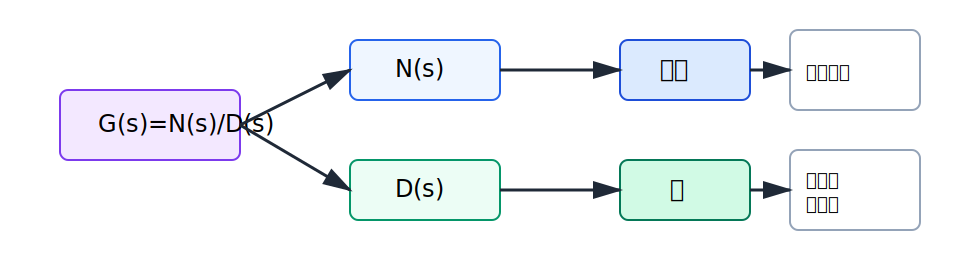
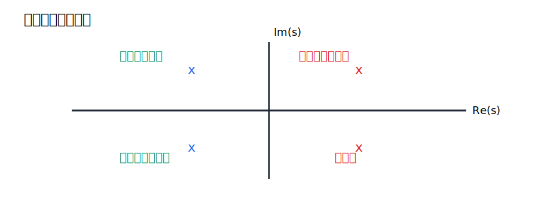
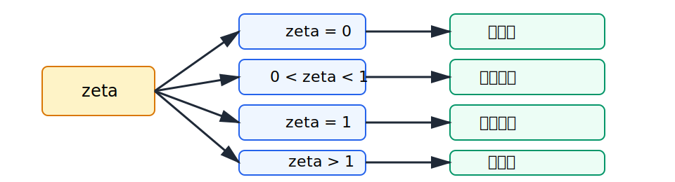
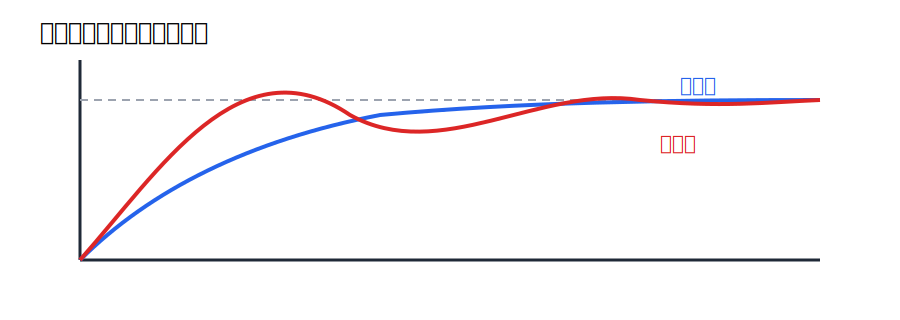

# 第3回 伝達関数

## 1. 導入（なぜこの概念が必要か）

この回の中心概念は、「伝達関数は入力から出力への動特性を $s$ 領域で表したものであり、極と零点がその性格を決める」である。特に極は、安定性と時間応答の骨格に直接結びつく。

前回、ラプラス変換を用いると微分方程式から入出力比

$$
G(s)=\frac{Y(s)}{U(s)}
$$

が得られることを見た。これが伝達関数である。伝達関数の嬉しさは、複雑な時間応答を、分子と分母の多項式という比較的扱いやすい形に圧縮してくれる点にある。

しかし、伝達関数をただの分数式として眺めても制御設計にはつながらない。重要なのは、その式のどこが応答の速さ、振動、増幅、安定性を決めているかを読むことである。その鍵が極と零点である。

古典制御理論では、極の位置から安定性や過渡応答を判断し、零点の位置から応答の形や位相特性への影響を読む。本講義で解決したい問いは次の通りである。

- 極と零点とは何か
- なぜ極の位置が安定性を決めるのか
- 一次系と二次系の応答は、伝達関数からどう読めるのか

ここで得たい感覚は、「伝達関数を見ると、時間応答の雰囲気が頭の中に立ち上がる」ことである。

## 2. 理論本体

### 2.1 定義

#### 定義 1（伝達関数）

線形時不変系に対し、ゼロ初期値のもとでの入力 $U(s)$ と出力 $Y(s)$ の比

$$
G(s)=\frac{Y(s)}{U(s)}
$$

を伝達関数という。

一般に

$$
G(s)=\frac{N(s)}{D(s)}
$$

と書く。ここで $N(s)$, $D(s)$ は $s$ の多項式である。

#### 定義 2（零点）

分子多項式 $N(s)$ をゼロにする複素数 $s$ を零点という。すなわち

$$
N(s)=0
$$

を満たす点である。

#### 定義 3（極）

分母多項式 $D(s)$ をゼロにする複素数 $s$ を極という。すなわち

$$
D(s)=0
$$

を満たす点である。

### 2.2 極と零点の概念図

この図は、伝達関数の分子と分母が別々の役割を持つことを示している。厳密には、零点は $N(s)=0$ を満たす点、極は $D(s)=0$ を満たす点である。特に制御では、分母の根である極が時間応答の骨格を決める。分子の根である零点も重要だが、まず中心にあるのは極である。

### 2.3 極と時間応答

最も基本的な観察は、

$$
\frac{1}{s-a}
$$

の逆ラプラス変換が

$$
e^{at}
$$

であることである。したがって、極 $s=a$ は時間応答の中に

$$
e^{at}
$$

という項を生じさせる。

もし

$$
a<0
$$

なら

$$
e^{at}\to 0 \quad (t\to\infty)
$$

であり、応答は減衰する。一方、

$$
a>0
$$

なら

$$
e^{at}\to \infty \quad (t\to\infty)
$$

であり、応答は発散する。これが極の位置と安定性の基本的な関係である。

複素極

$$
s=\alpha \pm j\beta
$$

に対しては、時間応答に

$$
e^{\alpha t}\cos \beta t, \qquad e^{\alpha t}\sin \beta t
$$

のような項が現れる。したがって、$\alpha$ が減衰、$\beta$ が振動の速さを決める。

### 2.4 命題

#### 命題 1

伝達関数の各極は、時間応答を構成する指数関数モードに対応する。

#### 証明の考え方

伝達関数を部分分数分解すると、単純極の場合には

$$
G(s)=\sum_{k=1}^n \frac{A_k}{s-p_k}
$$

の形になる。各項の逆ラプラス変換は

$$
\mathcal{L}^{-1}\left\{\frac{A_k}{s-p_k}\right\}=A_k e^{p_k t}
$$

である。したがって、極 $p_k$ ごとに $e^{p_k t}$ というモードが現れる。重複極の場合には $t e^{p_k t}$, $t^2 e^{p_k t}$ なども現れるが、やはり極が応答の核を決めている。証明終。

### 2.5 安定性

#### 定義 4（漸近安定）

連続時間線形時不変系が漸近安定であるとは、自由応答が時間とともにゼロへ収束することをいう。

#### 定理 1

有理型伝達関数をもつ連続時間線形時不変系が漸近安定であるための必要十分条件は、全ての極が複素平面の左半平面

$$
\operatorname{Re}(s)<0
$$

に存在することである。

#### 証明の説明

各極に対応して応答中に

$$
e^{p_k t}
$$

または重複極ならその多項式倍が現れる。$\operatorname{Re}(p_k)<0$ なら全てのモードは減衰するので自由応答はゼロへ向かう。逆に、ある極 $p_k$ に対して

$$
\operatorname{Re}(p_k)>0
$$

なら、そのモードは発散する。さらに $\operatorname{Re}(p_k)=0$ の極があると、単純極では持続振動、重複極では発散が生じうる。よって漸近安定のためには、全極が左半平面にあることが必要十分である。

### 2.6 極配置と安定性の図

この図は、極の位置と時間応答の関係を示したものである。実部は減衰か発散かを決め、虚部は振動の有無を決める。実際の複素平面上では、左半平面にある極は安定側、右半平面にある極は不安定側に対応する。

### 2.6.1 零点が応答形状へ与える影響

極が時間応答の骨格を決めるのに対し、零点は応答の形を整える。たとえば

$$
G(s)=\frac{s+z}{s+p}
$$

のように零点をもつ系では、分子が入力に対する重み付けを変えるため、立ち上がり初期の形やオーバーシュートの出やすさが変わることがある。したがって安定性の本質は極に支配されるが、設計では零点も無視できない。

### 2.7 一次系

一次系の代表形は

$$
G(s)=\frac{K}{Ts+1}
$$

である。ただし

$$
K>0, \qquad T>0
$$

とする。この極は

$$
Ts+1=0
$$

より

$$
s=-\frac{1}{T}
$$

である。

単位ステップ入力

$$
U(s)=\frac{1}{s}
$$

に対して

$$
Y(s)=\frac{K}{Ts+1}\cdot \frac{1}{s}
=\frac{K}{s(Ts+1)}
$$

となる。部分分数分解により

$$
y(t)=K\left(1-e^{-t/T}\right)
$$

が得られる。したがって一次系は、単調に目標値へ近づく緩やかな応答を示す。

### 2.8 二次系

二次系の標準形は

$$
G(s)=\frac{\omega_n^2}{s^2+2\zeta \omega_n s + \omega_n^2}
$$

である。ここで $\omega_n>0$ は固有角周波数、$\zeta$ は減衰係数である。

分母方程式

$$
s^2+2\zeta \omega_n s + \omega_n^2=0
$$

を解くと

$$
s=\frac{-2\zeta \omega_n \pm \sqrt{4\zeta^2\omega_n^2-4\omega_n^2}}{2}
$$

したがって

$$
s=-\zeta \omega_n \pm \omega_n \sqrt{\zeta^2-1}
$$

を得る。

特に

$$
0<\zeta<1
$$

なら

$$
s=-\zeta \omega_n \pm j\omega_n\sqrt{1-\zeta^2}
$$

となり、減衰振動が生じる。$\zeta$ が小さいほど振動的で、$\zeta$ が大きいほど単調に近い応答になる。

### 2.9 二次系の応答分類図

この図は、二次系の挙動が減衰係数 $\zeta$ によって分類されることを示している。第4回の時間応答では、これらの違いが立ち上がり時間、オーバーシュート、整定時間として定量化される。

## 3. 直感的理解

### 3.1 幾何学的解釈

伝達関数は、複素平面上の位置 $s$ に対する入出力比である。その中で極は「系が強く反応する内部モード」を示す点であり、零点は「ある形の入力成分を打ち消す」点だと直感できる。

### 3.2 物理的意味

ばね質量ダンパ系を考えると、質量は慣性、ばねは復元力、ダンパは減衰を与える。これらの物理作用の組合せが二次系の分母に現れ、極として応答の速さと振動性を支配する。したがって極は、単なる計算上の根ではなく、物理モードの写像である。

同じ伝達関数の見方は、機械系でも電気系でも共通である。たとえば一次系

$$
\frac{1}{Ts+1}
$$

は、RC 回路のコンデンサ電圧にも、粘性抵抗をもつ簡単な速度系にも現れる。二次系

$$
\frac{\omega_n^2}{s^2+2\zeta\omega_n s+\omega_n^2}
$$

は、ばね・質量・ダンパー系や RLC 回路に現れる。つまり伝達関数は、装置の見た目を越えて動特性の型を取り出す言語である。

### 3.3 設計視点からの解釈

設計では、望ましい応答を与えるように閉ループ極を配置したい。極を左へ動かすと応答は速くなるが、入力の大きさやノイズ感度とのトレードオフがある。また、複素極を持つと振動的応答になるため、減衰係数との兼ね合いが重要になる。

### 3.4 よくある誤解

- 極が多いほど必ず不安定だ、という理解は誤りである
- 零点は重要でない、という理解も誤りである
- 分母だけ見れば常に十分、という理解も危険である

ただし初学段階では、まず分母と極が安定性と過渡応答の骨格を決めることをしっかり押さえるのが重要である。

## 4. 具体例

### 4.1 一次系の例

次の伝達関数を考える。

$$
G_1(s)=\frac{2}{s+2}
$$

この極は

$$
s=-2
$$

である。単位ステップ入力に対して

$$
Y_1(s)=\frac{2}{s+2}\cdot \frac{1}{s}
=\frac{2}{s(s+2)}
$$

である。部分分数分解を

$$
\frac{2}{s(s+2)}=\frac{A}{s}+\frac{B}{s+2}
$$

と置く。両辺に $s(s+2)$ を掛けて

$$
2=A(s+2)+Bs
$$

である。したがって

$$
2=(A+B)s+2A
$$

であるから、

$$
A=1, \qquad A+B=0
$$

よって

$$
B=-1
$$

である。したがって

$$
Y_1(s)=\frac{1}{s}-\frac{1}{s+2}
$$

なので

$$
y_1(t)=1-e^{-2t}
$$

を得る。

### 4.2 二次系の例

次の二次系を考える。

$$
G_2(s)=\frac{25}{s^2+4s+25}
$$

極を求めるために

$$
s^2+4s+25=0
$$

を解く。平方完成すると

$$
s^2+4s+25=(s+2)^2+21
$$

である。よって

$$
(s+2)^2=-21
$$

となるので、

$$
s=-2\pm j\sqrt{21}
$$

である。実部が $-2$ なので安定であり、虚部をもつので振動的応答を示す。

### 4.3 一次系と二次系の応答模式図

この図は、一次系が単調に目標値へ近づくのに対し、二次系は条件によってオーバーシュートを伴うことを示している。極が実数 1 個なら単調になりやすく、複素共役極をもつと振動的になりやすい、という極と応答の関係を視覚化している。

### 4.4 零点をもつ例

次の伝達関数を考える。

$$
G_3(s)=\frac{s+1}{s+3}
$$

このとき零点は

$$
s=-1
$$

であり、極は

$$
s=-3
$$

である。安定性は極で決まるので、この系は安定である。ただし、零点の存在によって入力に対する出力の立ち上がり方や位相特性が変わる。したがって零点は「安定性を決めないから無視してよい」のではなく、「安定性とは別の形で応答に効く」と理解する必要がある。

## 5. 演習問題（3〜5問）

### 問1（★）

伝達関数

$$
G(s)=\frac{s+2}{s^2+5s+6}
$$

の極と零点を求めよ。

### 問2（★）

極が

$$
s=-3
$$

に 1 つだけある系の時間応答モードはどのような形になるか説明せよ。

### 問3（★★）

一次系

$$
G(s)=\frac{4}{2s+1}
$$

の極を求め、安定かどうか判定せよ。

### 問4（★★）

二次系

$$
G(s)=\frac{9}{s^2+6s+9}
$$

の極を求め、減衰の種類を判定せよ。

### 問5（★★★）

なぜ連続時間線形時不変系の安定性は零点ではなく極によって決まるのか、部分分数分解と逆ラプラス変換の観点から説明せよ。

## 6. 演習解答解説

### 問1 解答

まず分子を因数分解すると

$$
s+2=0
$$

より零点は

$$
s=-2
$$

である。次に分母を因数分解すると

$$
s^2+5s+6=(s+2)(s+3)
$$

であるから、極は

$$
s=-2, \qquad s=-3
$$

である。

### 問2 解答

極が

$$
s=-3
$$

であるということは、応答中に

$$
e^{-3t}
$$

というモードが現れることを意味する。これは時間とともにゼロへ減衰する指数関数である。したがってこのモード単独で見れば安定であり、減衰の速さは指数の係数 $3$ によって決まる。

### 問3 解答

極は分母

$$
2s+1=0
$$

を解いて

$$
s=-\frac{1}{2}
$$

である。実部が負なので安定である。

つまずきやすい点は、分子の係数 $4$ は極の位置を変えないことである。極は分母だけで決まる。

### 問4 解答

分母は

$$
s^2+6s+9=(s+3)^2
$$

と因数分解できる。したがって極は

$$
s=-3
$$

の重複極である。

標準形

$$
s^2+2\zeta\omega_n s+\omega_n^2
$$

と比べると

$$
\omega_n=3, \qquad 2\zeta\omega_n=6
$$

だから

$$
2\zeta\cdot 3=6
$$

より

$$
\zeta=1
$$

である。したがって臨界減衰である。

### 問5 解答

部分分数分解を行うと、伝達関数や応答のラプラス像は

$$
\frac{A_k}{s-p_k}
$$

の和に分解される。逆ラプラス変換すると各項は

$$
A_k e^{p_k t}
$$

になる。ここで指数関数の増減を決めるのは $p_k$ の実部であり、これは極である。したがって応答が減衰するか発散するかは極の位置で決まる。

一方、零点は分子の根であり、係数 $A_k$ や入力に対する形を変えるが、時間応答の指数モードそのものを作るのは分母側である。よって安定性の本質は零点ではなく極に支配される。

## 7. まとめ

この回で得た武器は次の3つである。

- 伝達関数の分子と分母から零点と極を読めること
- 極の位置と安定性・振動性の関係を説明できること
- 一次系と二次系の応答の違いを伝達関数から読み始められること

次回は時間応答をさらに詳しく扱う。今回見た一次系・二次系に対して、立ち上がり時間、オーバーシュート、整定時間などの指標を導入し、極の位置と応答形状の対応をより定量的に理解する。
