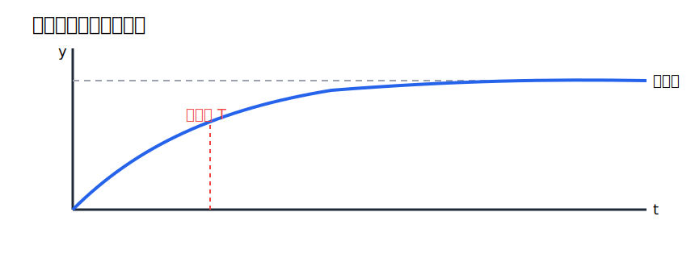
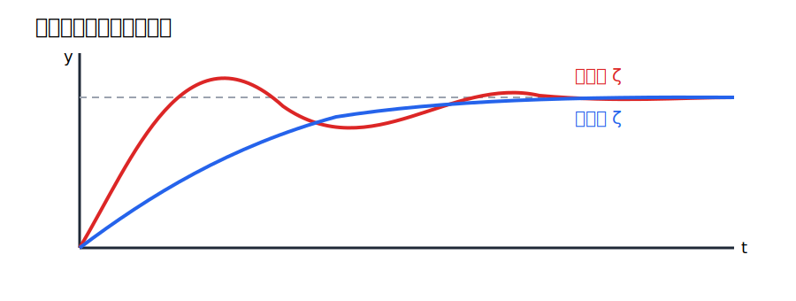
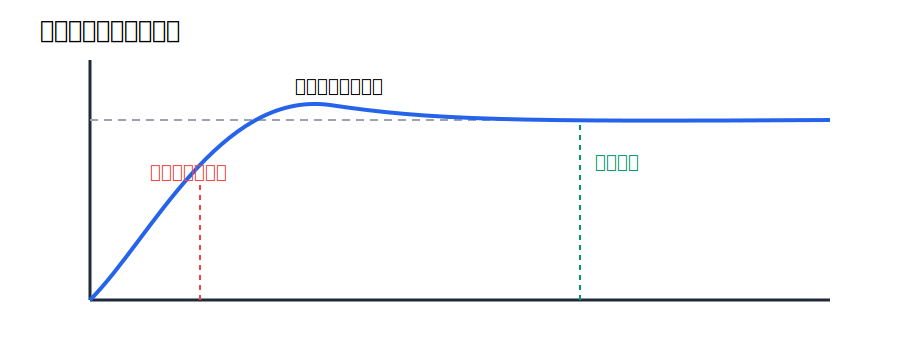

# 第4回 時間応答

## 1. 導入（なぜこの概念が必要か）

前回までに、伝達関数の極と零点から系の安定性や振動性を読む準備をした。しかし、設計者が最終的に知りたいのは、入力を加えたとき出力が時間的にどう変化するかである。すなわち、目標値を入れた直後にどれだけ速く立ち上がるか、どれだけ行き過ぎるか、どれくらいで落ち着くか、という問いである。

このような時間的な振る舞いを扱うのが時間応答である。古典制御において時間応答を学ぶ嬉しさは、極の位置と現実の見え方がつながる点にある。複素平面上の抽象的な根が、立ち上がり時間、オーバーシュート、整定時間といった具体的な工学量に対応するのである。

本講義では、特に次の3点を明確にする。

- ステップ応答とは何か
- 過渡応答と定常応答をどう区別するか
- 二次系の減衰係数 $\zeta$ と固有角周波数 $\omega_n$ が応答をどう支配するか

この回で得たい気持ちは、「伝達関数の式を見たとき、その時間波形の雰囲気をかなり具体的に想像できる」という状態になることである。

## 2. 理論本体

### 2.1 ステップ応答の定義

#### 定義 1（ステップ入力）

単位ステップ関数を

$$
u(t)=
\begin{cases}
0, & t<0,\\
1, & t\ge 0
\end{cases}
$$

と定める。ラプラス像は

$$
U(s)=\frac{1}{s}
$$

である。

#### 定義 2（ステップ応答）

系の入力に単位ステップ関数を加えたときの出力 $y(t)$ を、その系のステップ応答という。

ステップ応答が重要なのは、目標値の急変に対する系の基本性能を簡潔に表すからである。サーボ系で目標値を切り替える、温度制御で設定温度を変える、といった状況の原型になっている。

### 2.2 応答の分解

出力応答は一般に、過渡応答と定常応答に分けて考える。

#### 定義 3（過渡応答）

入力や初期条件の変化直後に現れ、時間が経つにつれて減衰していく部分を過渡応答という。

#### 定義 4（定常応答）

時間が十分経った後に残る部分を定常応答という。

たとえば安定な一次系

$$
G(s)=\frac{K}{Ts+1}
$$

の単位ステップ応答

$$
y(t)=K\left(1-e^{-t/T}\right)
$$

では、

$$
-Ke^{-t/T}
$$

が過渡応答、

$$
K
$$

が定常応答である。

### 2.3 応答指標

時間応答を評価するために、次の指標を用いる。

#### 定義 5（立ち上がり時間）

出力が目標値のある低い割合から高い割合まで達するのに要する時間を立ち上がり時間という。厳密な定義は文脈により異なるが、しばしば 10% から 90% までの時間を用いる。

#### 定義 6（オーバーシュート）

出力が最終値をどれだけ上回ったかを示す量をオーバーシュートという。最大値 $y_{\max}$、最終値 $y_\infty$ に対し、

$$
M_p=\frac{y_{\max}-y_\infty}{y_\infty}
$$

と定めることが多い。

#### 定義 7（整定時間）

出力が最終値の近傍、たとえば $\pm 2\%$ の範囲に入り、その後外れなくなるまでの時間を整定時間という。

これらの指標は、単に式を解くためではなく、設計仕様を言葉にするために重要である。たとえば「2 秒以内に整定してほしい」「オーバーシュートは 10% 未満にしたい」といった要求は、この言葉で表現される。

### 2.4 一次系の時間応答

一次系

$$
G(s)=\frac{K}{Ts+1}
$$

に単位ステップ入力

$$
U(s)=\frac{1}{s}
$$

を加えると

$$
Y(s)=\frac{K}{Ts+1}\cdot\frac{1}{s}
=\frac{K}{s(Ts+1)}
$$

である。部分分数分解を

$$
\frac{K}{s(Ts+1)}=\frac{A}{s}+\frac{B}{Ts+1}
$$

と置く。両辺に $s(Ts+1)$ を掛けると

$$
K=A(Ts+1)+Bs
$$

である。これを整理して

$$
K=(AT+B)s+A
$$

となる。係数比較により

$$
A=K,\qquad AT+B=0
$$

である。したがって

$$
B=-KT
$$

であり、

$$
Y(s)=\frac{K}{s}-\frac{KT}{Ts+1}
=\frac{K}{s}-\frac{K}{s+\frac{1}{T}}
$$

となる。逆変換して

$$
y(t)=K\left(1-e^{-t/T}\right)
$$

を得る。

この応答は単調であり、オーバーシュートを持たない。したがって一次系では、主として時定数 $T$ が応答の速さを支配する。

### 2.5 一次系の模式図

この図は一次系の典型的なステップ応答を示している。初期値 0 から単調に増加し、最終値へ滑らかに近づく。時定数 $T$ が小さいほど曲線は急に立ち上がり、応答が速くなる。

### 2.6 二次系の時間応答

二次系の標準形を

$$
G(s)=\frac{\omega_n^2}{s^2+2\zeta\omega_n s+\omega_n^2}
$$

とする。単位ステップ入力に対して

$$
Y(s)=\frac{\omega_n^2}{s\left(s^2+2\zeta\omega_n s+\omega_n^2\right)}
$$

となる。

特に

$$
0<\zeta<1
$$

では極は

$$
s=-\zeta\omega_n\pm j\omega_n\sqrt{1-\zeta^2}
$$

となるので、時間応答は減衰振動を伴う。詳細な逆変換の結果として、単位ステップ応答は

$$
y(t)=1-\frac{e^{-\zeta\omega_n t}}{\sqrt{1-\zeta^2}}
\sin\left(\omega_n\sqrt{1-\zeta^2}\,t+\phi\right)
$$

の形に整理できる。ただし $\phi$ は $\zeta$ に依存する定数である。

ここで重要なのは、式の細部よりも次の対応である。

- $\omega_n$ が大きいほど、応答全体は速くなる
- $\zeta$ が小さいほど、振動的でオーバーシュートが大きい
- $\zeta$ が大きいほど、振動は抑えられるが応答が鈍くなる場合がある

### 2.7 オーバーシュート公式

不足減衰二次系では、最大オーバーシュートは

$$
M_p=\exp\left(-\frac{\zeta\pi}{\sqrt{1-\zeta^2}}\right)
$$

で与えられる。

#### 命題 1

上式より、$0<\zeta<1$ の範囲では $\zeta$ が大きいほど $M_p$ は小さくなる。

#### 証明の考え方

分母

$$
\sqrt{1-\zeta^2}
$$

は $\zeta$ が大きくなると小さくなるが、指数部全体

$$
\frac{\zeta\pi}{\sqrt{1-\zeta^2}}
$$

は増加する。したがって負号付き指数

$$
\exp\left(-\frac{\zeta\pi}{\sqrt{1-\zeta^2}}\right)
$$

は小さくなる。よって $\zeta$ を大きくするとオーバーシュートは抑えられる。

### 2.8 二次系の応答図

この図では、減衰係数 $\zeta$ が小さいと振動が強く、$\zeta$ が大きいとより滑らかに目標値へ近づくことが見える。ここで大切なのは、減衰を大きくすれば常に速いとは限らず、振動抑制と応答速度の間に設計上の折り合いがあることである。

## 3. 直感的理解

### 3.1 幾何学的解釈

極が実軸上の 1 点なら、応答は単調に減衰しやすい。複素共役極なら、実部が包絡線の減衰を、虚部が振動の速さを決める。したがって、複素平面上の極の位置を動かすことは、波形の形を直接変えることに対応する。

### 3.2 物理的意味

ばね質量ダンパ系で考えると、質量は動き続けようとし、ばねは元へ戻そうとし、ダンパは動きを抑える。ダンパが弱いと行き過ぎて振動し、強いと振動は減るが動きも鈍くなる。この感覚が二次系の時間応答にそのまま現れる。

### 3.3 設計視点からの解釈

時間応答を見ると、系が「使いやすいか」が直感的に分かる。速いが大きく振れる系、遅いが安定に見える系、ちょうどよい折り合いの系、という設計判断は時間応答で行うことが多い。

### 3.4 よくある誤解

- 速ければ常に良い、という理解は誤りである
- オーバーシュートがゼロなら最良、という理解も誤りである
- 極だけ分かれば時間応答を完全に決められる、という理解も初学段階では単純化しすぎである

ただし初学段階では、一次系・二次系の主要な挙動は極と減衰係数からかなりよく読める、という理解が重要である。

## 4. 具体例

### 4.1 一次系の数値例

$$
G(s)=\frac{1}{0.5s+1}
$$

を考える。このとき

$$
T=0.5
$$

であるから、単位ステップ応答は

$$
y(t)=1-e^{-2t}
$$

となる。時定数が小さいので、比較的速く最終値に近づく。

### 4.2 二次系の数値例

$$
G(s)=\frac{25}{s^2+4s+25}
$$

では

$$
\omega_n=5,\qquad 2\zeta\omega_n=4
$$

だから

$$
\zeta=\frac{4}{10}=0.4
$$

である。したがって不足減衰であり、目標値を一度上回る振動的応答を示す。

### 4.3 指標の模式図

この図は、立ち上がり時間、オーバーシュート、整定時間がどこを見て定義されるかを示している。式の定義だけだと抽象的だが、波形上の位置として見ると意味がつかみやすい。

## 5. 演習問題（3〜5問）

### 問1（★）

一次系

$$
G(s)=\frac{2}{s+2}
$$

の単位ステップ応答を求めよ。

### 問2（★）

過渡応答と定常応答の違いを、一次系のステップ応答を例に説明せよ。

### 問3（★★）

二次系

$$
G(s)=\frac{16}{s^2+4s+16}
$$

について、$\omega_n$ と $\zeta$ を求めよ。

### 問4（★★）

減衰係数 $\zeta$ が小さくなると、オーバーシュートが増えやすい理由を説明せよ。

### 問5（★★★）

一次系と二次系の時間応答の違いを、極の観点から説明せよ。

## 6. 演習解答解説

### 問1 解答

単位ステップ入力に対して

$$
Y(s)=\frac{2}{s+2}\cdot\frac{1}{s}
=\frac{2}{s(s+2)}
$$

である。部分分数分解を

$$
\frac{2}{s(s+2)}=\frac{A}{s}+\frac{B}{s+2}
$$

と置くと、

$$
2=A(s+2)+Bs
$$

である。したがって

$$
2=(A+B)s+2A
$$

より

$$
A=1,\qquad B=-1
$$

となる。よって

$$
Y(s)=\frac{1}{s}-\frac{1}{s+2}
$$

なので、

$$
y(t)=1-e^{-2t}
$$

である。

### 問2 解答

たとえば

$$
y(t)=1-e^{-2t}
$$

では、

$$
-e^{-2t}
$$

が時間とともに消えていく過渡応答であり、

$$
1
$$

が最終的に残る定常応答である。過渡応答は立ち上がりや振動を特徴づけ、定常応答は最終的な到達値を決める。

### 問3 解答

標準形

$$
\frac{\omega_n^2}{s^2+2\zeta\omega_n s+\omega_n^2}
$$

と比較すると

$$
\omega_n^2=16
$$

より

$$
\omega_n=4
$$

である。また

$$
2\zeta\omega_n=4
$$

だから

$$
2\zeta\cdot 4=4
$$

となり、

$$
\zeta=\frac{1}{2}
$$

である。

### 問4 解答

$\zeta$ が小さいと複素極の実部に対して虚部の影響が相対的に強くなり、振動が強く出やすい。その結果、目標値を通り過ぎて最大値が最終値を上回る、すなわちオーバーシュートが生じやすくなる。

### 問5 解答

一次系は通常、実数極を 1 つ持つため

$$
e^{-at}
$$

型の単調な減衰応答を示す。これに対し二次系は、複素共役極を持つと

$$
e^{\alpha t}\cos\beta t,\qquad e^{\alpha t}\sin\beta t
$$

型の振動成分を含む。したがって二次系ではオーバーシュートや振動が現れうる。極の構造の違いが時間応答の違いに直結している。

## 7. まとめ

この回で得た武器は次の3つである。

- ステップ応答、過渡応答、定常応答を区別して説明できること
- 一次系と二次系の時間応答の特徴を読み分けられること
- $\zeta$ と $\omega_n$ が応答速度と振動性を支配すること

次回はブロック線図を扱う。ここまで得た伝達関数を複数接続したとき、全体の入出力関係をどう整理するかを学ぶ。これにより、複雑な制御系も基本ブロックの組合せとして扱えるようになる。
