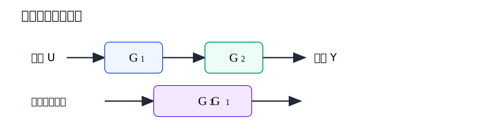
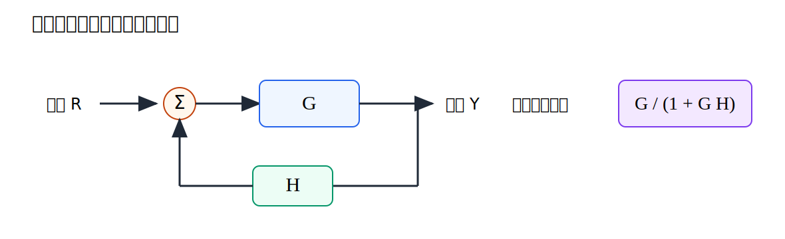
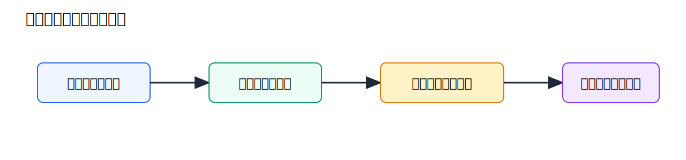
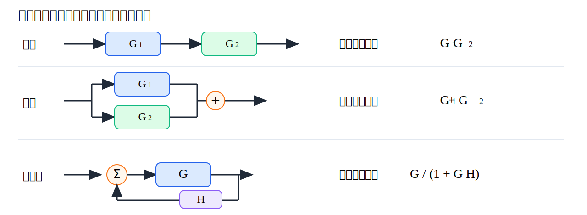

# 第5回 ブロック線図

## 1. 導入（なぜこの概念が必要か）

この回の中心概念は、「複数要素からなる系を信号の流れとして表し、等価変換で全体を整理できる」である。伝達関数の計算を、複雑な構成を含む実系へ拡張するための言語がブロック線図である。

伝達関数が分かると、個々の要素の入出力関係は記述できる。しかし、実際の制御系は 1 つの要素だけで完結することは少ない。センサ、制御器、プラント、補償器、フィルタなどが接続され、全体として 1 つの系を構成する。こうした複合系を整理するための言語がブロック線図である。

ブロック線図の嬉しさは、複雑な接続関係を見える形にし、しかも代数的に整理できる点にある。直列なら掛け算、並列なら足し算、フィードバックなら

$$
\frac{G}{1\pm GH}
$$

という形へ変換できる。これにより、大きな制御系も少数の基本則で扱える。

本講義で解決したい問いは次の通りである。

- 直列・並列・フィードバック接続をどう等価化するか
- ブロック線図の変換はなぜ正しいのか
- 複雑な図をどう順番に簡約するか

## 2. 理論本体

### 2.1 ブロック線図の基本

ブロック線図では、各ブロックが伝達関数を表し、矢印が信号の流れを表す。入力を $U(s)$、出力を $Y(s)$、伝達関数を $G(s)$ とすると、

$$
Y(s)=G(s)U(s)
$$

である。

加算点では複数の信号を足し引きし、分岐点では同じ信号を複数経路へ送る。したがってブロック線図を正しく読むには、「何が同じ信号で、どこで和差が取られているか」を明確にする必要がある。

とくに重要なのは、信号の向きを取り違えないこと、加算点で何が正符号で何が負符号かを明確にすること、分岐点では信号値が保存されることである。これは後の等価変換の正しさに直結する。

### 2.2 直列接続

2 つのブロック $G_1(s)$, $G_2(s)$ を直列に接続する。入力を $U(s)$、中間信号を $X(s)$、出力を $Y(s)$ とすると

$$
X(s)=G_1(s)U(s)
$$

および

$$
Y(s)=G_2(s)X(s)
$$

である。第1式を第2式へ代入すると

$$
Y(s)=G_2(s)G_1(s)U(s)
$$

である。よって等価伝達関数は

$$
G_{\mathrm{eq}}(s)=G_2(s)G_1(s)
$$

である。

### 2.3 直列接続の図

この図は、信号が順番に 2 つのブロックを通るとき、全体としてブロックの積にまとめられることを示している。時間領域では段階的に処理されるが、$s$ 領域では代数的に掛け算へ圧縮される。

### 2.4 並列接続

同じ入力 $U(s)$ が 2 つのブロック $G_1(s)$, $G_2(s)$ へ入り、その出力が加算されるとする。このとき

$$
Y_1(s)=G_1(s)U(s),\qquad Y_2(s)=G_2(s)U(s)
$$

であり、全出力は

$$
Y(s)=Y_1(s)+Y_2(s)
$$

である。したがって

$$
Y(s)=\left(G_1(s)+G_2(s)\right)U(s)
$$

となる。よって等価伝達関数は

$$
G_{\mathrm{eq}}(s)=G_1(s)+G_2(s)
$$

である。

### 2.5 フィードバック接続

最も重要なのはフィードバック接続である。前向き要素を $G(s)$、フィードバック要素を $H(s)$、入力を $R(s)$、出力を $Y(s)$ とする。負帰還では誤差は

$$
E(s)=R(s)-H(s)Y(s)
$$

である。出力は

$$
Y(s)=G(s)E(s)
$$

であるから、

$$
Y(s)=G(s)\left(R(s)-H(s)Y(s)\right)
$$

となる。展開して

$$
Y(s)=G(s)R(s)-G(s)H(s)Y(s)
$$

である。$Y(s)$ を左辺に集めると

$$
Y(s)+G(s)H(s)Y(s)=G(s)R(s)
$$

したがって

$$
\left(1+G(s)H(s)\right)Y(s)=G(s)R(s)
$$

である。よって

$$
\frac{Y(s)}{R(s)}=\frac{G(s)}{1+G(s)H(s)}
$$

を得る。

### 2.6 フィードバック接続の図

この図は、負帰還系が

$$
\frac{G}{1+GH}
$$

に簡約されることを示している。ブロック線図の見た目としては複雑でも、数式に落とすと非常に秩序立っていることが分かる。

### 2.7 等価変換

ブロック線図の変換では、加算点や分岐点をブロックの前後で移動することがある。そのとき重要なのは、移動後も各信号の関係が保たれることである。たとえばブロック $G$ の後ろに加算点がある場合と前に加算点を移す場合では、必要に応じて別経路に $G$ を掛ける補正が必要になる。

#### 命題 1

ブロック線図の等価変換は、各内部信号の関係を保存するように行われる限り、入出力伝達関数を変えない。

#### 証明の考え方

各変換前後で中間信号を文字で置き、それらの代数関係を書き下せばよい。変換前後で

$$
\frac{Y(s)}{U(s)}
$$

が一致すれば等価である。ブロック線図の変換は図形操作に見えるが、本質は信号方程式の保存である。

### 2.8 変換の手順

複雑なブロック線図は、一般に次の順で簡約すると扱いやすい。

1. 直列部分をまとめる
2. 並列部分をまとめる
3. 最も内側のフィードバックループをまとめる
4. 必要なら加算点・分岐点を移動して再び 1 へ戻る

この手順の嬉しさは、複雑な図を一度に解こうとせず、局所的に秩序立てて簡約できる点にある。

### 2.9 複合系の模式図

この図は、複合系を段階的に簡約していく考え方を表している。重要なのは、いきなり答えを見抜くことではなく、局所的な規則を繰り返し適用することである。

## 3. 直感的理解

### 3.1 幾何学的解釈

ブロック線図は、複数の変換器が矢印でつながったネットワークである。直列は「順に処理する」、並列は「別々に処理して足し合わせる」、フィードバックは「結果を見て修正する」と読むと直感がつかみやすい。

### 3.2 物理的意味

温度制御系なら、設定温度から誤差を作り、制御器がヒータ出力を決め、部屋が応答し、センサが温度を返す。この一連の流れをブロック線図にすると、どこで測ってどこで補正しているかが明確になる。

モータ速度制御であれば、指令速度、制御器、増幅器、モータ、速度センサがそれぞれブロックとして表せる。つまりブロック線図は抽象的な記法であると同時に、実際の機器構成を整理する地図でもある。

### 3.3 設計視点からの解釈

設計では、全体を 1 つの伝達関数に落とし込みたいことが多い。ブロック線図の簡約ができると、複雑な制御系を「設計できる形」へ整理できる。これは理論と実装の橋渡しである。

### 3.4 よくある誤解

- 図を見た目だけで動かしてよい、という理解は誤りである
- 分岐点と加算点は自由に動かせる、という理解も誤りである
- フィードバックは見つけたらすぐ分母に $1+GH$ を書けばよい、という理解も危険である

どの信号が何を表すかを一度文字で置く習慣が、変換ミスを大きく減らす。

また、ブロック線図の等価変換は図形パズルではない。常に信号方程式が保存されているかを確認する姿勢が重要である。

## 4. 具体例

### 4.1 直列と並列の例

次の複合系を考える。

$$
G_1(s)=\frac{2}{s+1},\qquad G_2(s)=\frac{3}{s+2}
$$

が直列接続なら、

$$
G_{\mathrm{eq}}(s)=\frac{2}{s+1}\cdot\frac{3}{s+2}
=\frac{6}{(s+1)(s+2)}
$$

である。

一方、並列接続なら

$$
G_{\mathrm{eq}}(s)=\frac{2}{s+1}+\frac{3}{s+2}
$$

である。通分すると

$$
G_{\mathrm{eq}}(s)=\frac{2(s+2)+3(s+1)}{(s+1)(s+2)}
=\frac{2s+4+3s+3}{(s+1)(s+2)}
$$

したがって

$$
G_{\mathrm{eq}}(s)=\frac{5s+7}{(s+1)(s+2)}
$$

を得る。

### 4.2 フィードバックの例

$$
G(s)=\frac{5}{s+1},\qquad H(s)=1
$$

とする。負帰還なら

$$
\frac{Y(s)}{R(s)}=\frac{G(s)}{1+G(s)H(s)}
=\frac{\frac{5}{s+1}}{1+\frac{5}{s+1}}
$$

である。分母を通分すると

$$
1+\frac{5}{s+1}=\frac{s+1+5}{s+1}
=\frac{s+6}{s+1}
$$

したがって

$$
\frac{Y(s)}{R(s)}
=\frac{\frac{5}{s+1}}{\frac{s+6}{s+1}}
=\frac{5}{s+6}
$$

である。

### 4.3 等価変換の図

この図は、3 つの基本接続と等価伝達関数の対応を一枚で整理したものである。計算規則を暗記するのでなく、「信号の流れがどうなるか」で読むことが大切である。

## 5. 演習問題（3〜5問）

### 問1（★）

直列接続された 2 つのブロック

$$
G_1(s),\qquad G_2(s)
$$

の等価伝達関数を求めよ。

### 問2（★）

並列接続が和になる理由を、信号の式を書いて説明せよ。

### 問3（★★）

負帰還系で前向き要素 $G(s)$、フィードバック要素 $H(s)$ のとき、閉ループ伝達関数を導出せよ。

### 問4（★★）

$$
G_1(s)=\frac{1}{s+1},\qquad G_2(s)=\frac{2}{s+3}
$$

の並列接続の等価伝達関数を求めよ。

### 問5（★★★）

ブロック線図の簡約で、加算点や分岐点の移動に注意が必要な理由を説明せよ。

## 6. 演習解答解説

### 問1 解答

入力を $U(s)$、中間信号を $X(s)$、出力を $Y(s)$ とすると

$$
X(s)=G_1(s)U(s)
$$

および

$$
Y(s)=G_2(s)X(s)
$$

である。よって

$$
Y(s)=G_2(s)G_1(s)U(s)
$$

となる。したがって等価伝達関数は

$$
G_{\mathrm{eq}}(s)=G_2(s)G_1(s)
$$

である。

### 問2 解答

並列では両方のブロックに同じ入力 $U(s)$ が入る。したがって

$$
Y_1(s)=G_1(s)U(s),\qquad Y_2(s)=G_2(s)U(s)
$$

である。出力が和なら

$$
Y(s)=Y_1(s)+Y_2(s)
$$

だから

$$
Y(s)=G_1(s)U(s)+G_2(s)U(s)
=\left(G_1(s)+G_2(s)\right)U(s)
$$

となる。よって並列接続は和に等価である。

### 問3 解答

負帰還では

$$
E(s)=R(s)-H(s)Y(s)
$$

であり、

$$
Y(s)=G(s)E(s)
$$

である。したがって

$$
Y(s)=G(s)\left(R(s)-H(s)Y(s)\right)
$$

である。展開して

$$
Y(s)=G(s)R(s)-G(s)H(s)Y(s)
$$

であるから、

$$
\left(1+G(s)H(s)\right)Y(s)=G(s)R(s)
$$

となる。よって

$$
\frac{Y(s)}{R(s)}=\frac{G(s)}{1+G(s)H(s)}
$$

を得る。

### 問4 解答

並列接続なので

$$
G_{\mathrm{eq}}(s)=\frac{1}{s+1}+\frac{2}{s+3}
$$

である。通分すると

$$
G_{\mathrm{eq}}(s)=\frac{s+3+2(s+1)}{(s+1)(s+3)}
$$

である。分子を整理して

$$
s+3+2s+2=3s+5
$$

だから

$$
G_{\mathrm{eq}}(s)=\frac{3s+5}{(s+1)(s+3)}
$$

である。

### 問5 解答

加算点や分岐点は、単なる見た目の記号ではなく、実際の信号演算を表している。したがって、それらを動かすときに補正なく移動すると、どの信号にどの伝達関数が掛かっているかが変わってしまう。すると入出力関係も変化し、もはや等価ではなくなる。よって移動前後で各信号式を確認することが必要である。

## 7. まとめ

この回で得た武器は次の3つである。

- 直列、並列、フィードバック接続の等価伝達関数を導けること
- ブロック線図変換の本質が信号方程式の保存であると理解したこと
- 複雑な制御系を局所的な規則で順に簡約できること

次回は周波数応答を扱う。ここまでで得た伝達関数を、今度は時間ではなく周波数の観点から読み、正弦入力に対する応答や特性の意味を理解していく。
