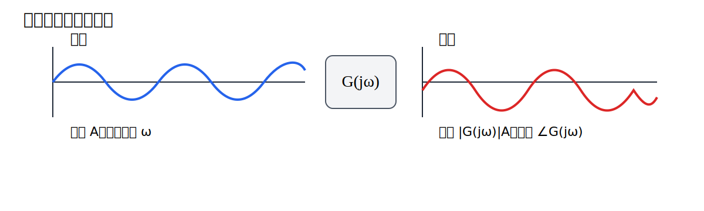
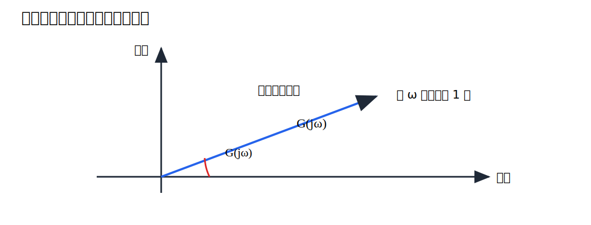
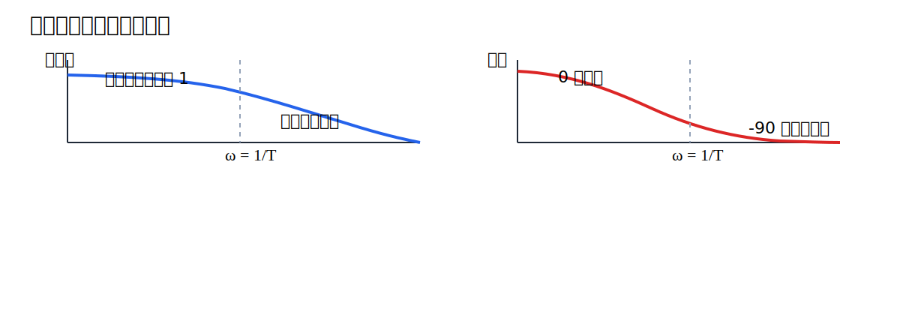

# 第6回 周波数応答

## 1. 導入（なぜこの概念が必要か）

この回の中心概念は、「正弦波入力に対する定常応答を見ると、系の周波数ごとの増幅率と位相遅れが分かる」である。時間波形を直接追う代わりに、周波数ごとに系の性格を読み取る視点へ切り替える。

第4回では時間応答を学び、入力を加えたとき出力が時間とともにどう変わるかを見た。第5回ではブロック線図を整理し、複雑な系を伝達関数として扱う準備を整えた。しかし、実際の制御設計では、時間応答だけでは見えにくい問いがある。たとえば、ある周波数の振動をどれだけ通しやすいか、どの周波数で位相が遅れるか、外乱の周期成分をどの程度抑えられるか、といった問いである。

こうした問いに答えるための言葉が周波数応答である。古典制御において周波数応答を学ぶ嬉しさは、微分方程式や伝達関数の式が「周波数ごとの増幅率と位相遅れ」という直観的な量に変わる点にある。時間領域で見ていた波形が、周波数ごとのふるまいとして整理されるのである。

本講義では、次の問いに答える。

- 正弦波入力に対して、安定な線形系はどのように応答するか
- $G(j\omega)$ は何を意味するか
- 振幅比と位相差は設計上どのような情報になるか

この回で得たい感覚は、「伝達関数に $s=j\omega$ を代入すると、周波数ごとの性格表が現れる」という理解である。

## 2. 理論本体

### 2.1 正弦波入力と複素表示

安定な連続時間線形時不変系を

$$
G(s)
$$

で表す。入力として角周波数 $\omega$ の正弦波

$$
u(t)=A\sin(\omega t)
$$

を考える。

正弦波は複素指数関数の虚部として

$$
u(t)=\Im \left\{ A e^{j\omega t} \right\}
$$

と表せる。線形性のため、まず複素入力

$$
\tilde{u}(t)=A e^{j\omega t}
$$

に対する応答を考え、最後に実部または虚部を取ればよい。

### 2.2 周波数応答の定義

#### 定義 1（周波数応答）

伝達関数 $G(s)$ に対し、虚軸上で

$$
G(j\omega)
$$

を評価したものを周波数応答という。ただし、$j\omega$ が極でない周波数に限る。

#### 定義 2（振幅比と位相）

周波数応答 $G(j\omega)$ の絶対値

$$
\left| G(j\omega) \right|
$$

を振幅比、偏角

$$
\angle G(j\omega)
$$

を位相という。

振幅比は「その周波数成分が何倍になるか」を表し、位相は「どれだけ進むか、あるいは遅れるか」を表す。

この図では、入力と出力が同じ周波数を持ちながら、振幅と位相だけが変わることを表している。周波数応答の重要な点は、安定な線形系では正弦波が正弦波のまま出てくることである。

### 2.3 正弦波入力に対する定常応答

#### 定理 1

安定な線形時不変系の伝達関数を $G(s)$ とする。複素入力

$$
\tilde{u}(t)=A e^{j\omega t}
$$

を加えると、定常状態では出力は

$$
\tilde{y}_{\mathrm{ss}}(t)=G(j\omega) A e^{j\omega t}
$$

となる。

#### 証明

複素入力のラプラス像は、$\Re(s)>0$ において

$$
\tilde{U}(s)=\frac{A}{s-j\omega}
$$

である。したがって出力のラプラス像は

$$
\tilde{Y}(s)=G(s)\tilde{U}(s)=\frac{A G(s)}{s-j\omega}
$$

である。$s=j\omega$ の近傍で $G(s)$ は正則であるとすると、部分分数的に

$$
\tilde{Y}(s)=\frac{A G(j\omega)}{s-j\omega}+\text{安定な極を持つ項}
$$

と分けられる。逆ラプラス変換すると

$$
\tilde{y}(t)=A G(j\omega)e^{j\omega t}+\text{過渡項}
$$

を得る。系が安定であるから、過渡項は $t\to\infty$ で 0 へ収束する。よって定常状態では

$$
\tilde{y}_{\mathrm{ss}}(t)=A G(j\omega)e^{j\omega t}
$$

である。証明終。

#### 系 1

$G(j\omega)$ を極形式

$$
G(j\omega)=\left| G(j\omega) \right| e^{j\phi(\omega)}
$$

と書けば、実入力

$$
u(t)=A\sin(\omega t)
$$

に対する定常出力は

$$
y_{\mathrm{ss}}(t)=A\left| G(j\omega) \right| \sin\left( \omega t+\phi(\omega) \right)
$$

となる。

### 2.4 複素平面上での意味

$G(j\omega)$ は一般に複素数であるから、

$$
G(j\omega)=\Re G(j\omega)+j \Im G(j\omega)
$$

と書ける。したがって各周波数 $\omega$ に対し、複素平面上の 1 点が対応する。

この図では、複素平面上のベクトルの長さが振幅比、偏角が位相を表している。つまり $G(j\omega)$ は、単なる代入結果ではなく、その周波数における「増幅と回転」の情報を持つ複素数である。

### 2.5 一次遅れ系の周波数応答

一次遅れ系

$$
G(s)=\frac{1}{Ts+1}
$$

を考える。$s=j\omega$ を代入すると

$$
G(j\omega)=\frac{1}{1+j\omega T}
$$

である。絶対値は

$$
\left| G(j\omega) \right|
=\frac{1}{\left| 1+j\omega T \right|}
=\frac{1}{\sqrt{1+(\omega T)^2}}
$$

であり、位相は

$$
\angle G(j\omega)=-\tan^{-1}(\omega T)
$$

である。

したがって、

$$
\omega \to 0
$$

では

$$
\left| G(j\omega) \right| \to 1, \qquad \angle G(j\omega) \to 0
$$

となり、低周波はほぼそのまま通る。一方、

$$
\omega \to \infty
$$

では

$$
\left| G(j\omega) \right| \to 0, \qquad \angle G(j\omega) \to -\frac{\pi}{2}
$$

となり、高周波は抑えられ、位相は遅れる。

この図から、一次遅れ系は低域通過特性を持つことが読み取れる。時間領域では「急な変化を嫌う」系であり、周波数領域では「高周波を通しにくい」系として表現される。

### 2.6 二次系と共振

標準二次系

$$
G(s)=\frac{\omega_n^2}{s^2+2\zeta \omega_n s+\omega_n^2}
$$

について、

$$
s=j\omega
$$

を代入すると

$$
G(j\omega)=\frac{\omega_n^2}{-\omega^2+j 2\zeta \omega_n \omega+\omega_n^2}
=\frac{\omega_n^2}{\omega_n^2-\omega^2+j 2\zeta \omega_n \omega}
$$

を得る。したがって振幅比は

$$
\left| G(j\omega) \right|
=\frac{\omega_n^2}{\sqrt{(\omega_n^2-\omega^2)^2+(2\zeta \omega_n \omega)^2}}
$$

である。

$\zeta$ が十分小さいとき、$\omega \approx \omega_n$ の近傍で振幅比が大きくなることがある。これを共振という。周波数応答は、時間応答で見た「振動しやすさ」を周波数の観点から捉え直したものといえる。

## 3. 直感的理解

### 3.1 幾何学的解釈

周波数応答は、各周波数に対し複素平面上のベクトルを 1 本対応させる操作である。ベクトルの長さが増幅率、向きが位相ずれである。したがって、周波数応答を見ることは「その周波数の波をどう変形するか」を見ることに等しい。

### 3.2 物理的意味

周波数の低い入力はゆっくり変化する入力、高い入力は速く振動する入力である。一次遅れ系が高周波を通しにくいのは、状態が速い変化についていけないからである。機械系なら慣性、電気系なら容量やインダクタンスがこの「ついていけなさ」を生む。

これは第4回の時間応答と表裏一体である。時間領域で「急な変化に対して滑らかにしか反応できない」と見えた性質が、周波数領域では「高周波成分を通しにくい」として現れる。したがって時間応答と周波数応答は別の話ではなく、同じ動特性の別表現である。

### 3.3 設計視点からの解釈

設計では、目標値追従に必要な低周波成分は通したいが、ノイズや高周波外乱は抑えたいことが多い。周波数応答は、この要求を「どの周波数を何倍にするか」という形で表現できるため、補償器設計の直接的な指針になる。

言い換えれば、低周波帯域では追従性を重視し、高周波帯域ではノイズ抑制やロバスト性を重視することが多い。どの周波数帯域で何を優先するか、という設計言語を与えてくれるのが周波数応答である。

### 3.4 よくある誤解

- $G(j\omega)$ は時間応答そのものではない
- 周波数応答は定常応答の情報であり、過渡応答をすべて含むわけではない
- 振幅比が大きいことは常によいわけではなく、共振やノイズ増幅の危険も意味する

## 4. 具体例

### 4.1 一次遅れ系の数値例

$$
G(s)=\frac{1}{0.5s+1}
$$

とする。$\omega=1$ における周波数応答は

$$
G(j)=\frac{1}{1+0.5j}
$$

である。振幅比は

$$
\left| G(j) \right|
=\frac{1}{\sqrt{1+0.5^2}}
=\frac{1}{\sqrt{1.25}}
$$

であり、数値的には

$$
\left| G(j) \right|\approx 0.894
$$

である。位相は

$$
\angle G(j)=-\tan^{-1}(0.5)\approx -26.6^\circ
$$

である。

したがって入力

$$
u(t)=\sin t
$$

に対し、定常出力は

$$
y_{\mathrm{ss}}(t)\approx 0.894 \sin(t-26.6^\circ)
$$

となる。

### 4.2 二次系の共振の例

$$
G(s)=\frac{25}{s^2+2s+25}
$$

を考える。ここで

$$
\omega_n=5, \qquad 2\zeta \omega_n=2
$$

より

$$
\zeta=0.2
$$

である。減衰が小さいので、$\omega=5$ 近傍で振幅比が大きくなりやすい。これは第4回の時間応答で見た「振動しやすい二次系」が、周波数領域では「特定周波数を強く通す二次系」として現れることを意味する。

## 5. 演習問題

### 問題1（★）

一次遅れ系

$$
G(s)=\frac{1}{2s+1}
$$

について、$\omega=2$ における振幅比と位相を求めよ。

### 問題2（★）

伝達関数

$$
G(s)=\frac{3}{s+3}
$$

に入力

$$
u(t)=2\sin(4t)
$$

を加えたときの定常出力を求めよ。

### 問題3（★★）

標準二次系

$$
G(s)=\frac{\omega_n^2}{s^2+2\zeta \omega_n s+\omega_n^2}
$$

に対して、$G(j\omega)$ の振幅比を導出せよ。

### 問題4（★★★）

周波数応答が設計において重要である理由を、追従性とノイズ抑制の観点から説明せよ。

## 6. 演習解答解説

### 解答1

$$
G(j\omega)=\frac{1}{1+j 2\omega}
$$

である。$\omega=2$ を代入すると

$$
G(j2)=\frac{1}{1+j4}
$$

である。したがって振幅比は

$$
\left| G(j2) \right|=\frac{1}{\sqrt{1+4^2}}=\frac{1}{\sqrt{17}}
$$

であり、位相は

$$
\angle G(j2)=-\tan^{-1}(4)
$$

である。

### 解答2

まず

$$
G(j4)=\frac{3}{3+j4}
$$

である。振幅比は

$$
\left| G(j4) \right|=\frac{3}{\sqrt{3^2+4^2}}=\frac{3}{5}
$$

である。位相は

$$
\angle G(j4)=-\tan^{-1}\left( \frac{4}{3} \right)
$$

である。

入力振幅は 2 であるから、出力振幅は

$$
2\cdot \frac{3}{5}=\frac{6}{5}
$$

である。よって定常出力は

$$
y_{\mathrm{ss}}(t)=\frac{6}{5}\sin\left(4t-\tan^{-1}\left( \frac{4}{3} \right)\right)
$$

となる。

### 解答3

$$
G(j\omega)=\frac{\omega_n^2}{\omega_n^2-\omega^2+j 2\zeta \omega_n \omega}
$$

である。複素数

$$
a+jb
$$

の絶対値は

$$
\sqrt{a^2+b^2}
$$

であるから、

$$
\left| G(j\omega) \right|
=\frac{\omega_n^2}{\sqrt{(\omega_n^2-\omega^2)^2+(2\zeta \omega_n \omega)^2}}
$$

となる。

### 解答4

低周波で振幅比が十分大きければ、目標値のゆっくりした変化にしっかり追従しやすい。一方、高周波で振幅比が大きすぎると、測定ノイズや周期外乱を強く通してしまう。したがって周波数応答は、「追従したい成分」と「抑えたい成分」を分けて考えるための設計言語になる。

つまずきやすい点は、振幅比が大きいことを一律に良いと考えてしまうことである。重要なのは、どの周波数で大きいかである。

## 7. まとめ

この回で得た武器は、伝達関数を各周波数で評価し、振幅比と位相として意味づける視点である。時間応答で見ていた系の性格を、周波数ごとの増幅と遅れに分解して理解できるようになった。

次回は、この周波数応答を見やすい図にしたボード線図を学ぶ。振幅比を dB、位相を度数法で描くことで、設計に必要な情報を一目で読む方法へ進む。
