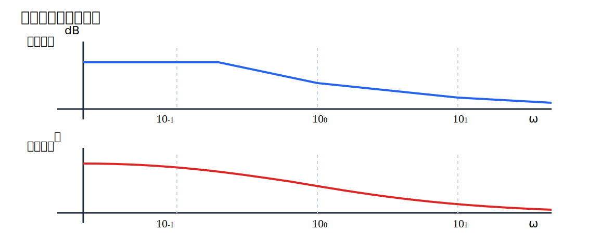
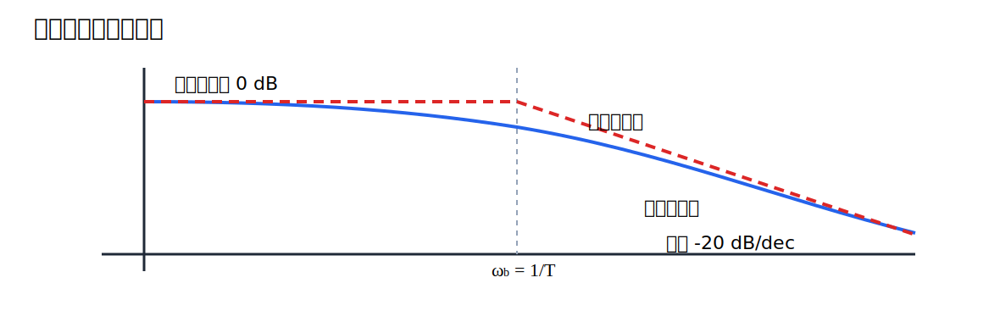
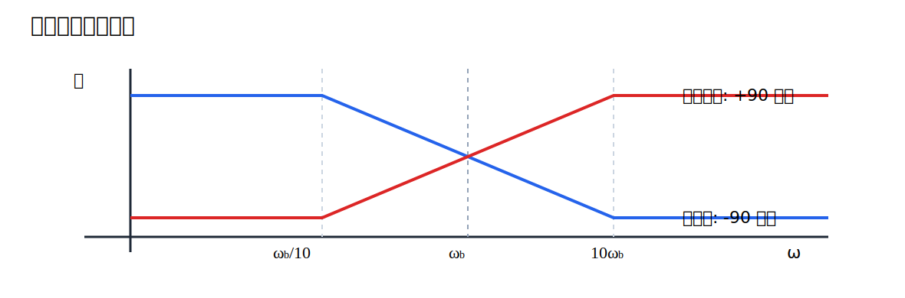

# 第7回 ボード線図（基礎）

## 1. 導入（なぜこの概念が必要か）

前回、周波数応答 $G(j\omega)$ が各周波数における振幅比と位相を与えることを学んだ。しかし、設計では個々の周波数で数値を計算するだけでは足りない。広い周波数帯域にわたって、どこで増幅し、どこで減衰し、どこで位相が遅れるかを一目で把握したい。

そのための道具がボード線図である。ボード線図の嬉しさは、積が和に変わり、傾きで極と零点の影響が読める点にある。伝達関数の構造が、グラフの折れ方として見えるのである。

本講義では次の問いに答える。

- ボード線図は何を描いた図か
- なぜ dB と対数周波数を使うのか
- 一次要素や積分要素の折れ線近似はどう作るか

この回で得たい感覚は、「伝達関数を因数分解すれば、ボード線図のおおよその形が頭の中で描ける」という状態である。

## 2. 理論本体

### 2.1 ボード線図の定義

#### 定義 1（ボード線図）

周波数応答 $G(j\omega)$ に対し、次の 2 つの図をまとめてボード線図という。

1. 振幅線図
2. 位相線図

振幅線図では

$$
20\log_{10}\left| G(j\omega) \right|
$$

を縦軸にとり、横軸には対数目盛の周波数 $\omega$ をとる。位相線図では

$$
\angle G(j\omega)
$$

を縦軸にとり、横軸には同様に対数目盛の周波数をとる。

この図では、上段が振幅線図、下段が位相線図である。横軸を対数にすることで、低周波から高周波までを見やすく並べることができる。

### 2.2 dB 表示の意味

#### 定義 2（デシベル）

振幅比 $M$ に対し、

$$
20\log_{10} M
$$

をデシベル表示という。

たとえば

$$
M=10
$$

なら

$$
20\log_{10} 10=20 \ \mathrm{dB}
$$

であり、

$$
M=0.1
$$

なら

$$
20\log_{10} 0.1=-20 \ \mathrm{dB}
$$

である。

dB を用いる最大の利点は、積が和になることである。もし

$$
G(j\omega)=G_1(j\omega)G_2(j\omega)
$$

なら

$$
20\log_{10}\left| G(j\omega) \right|
=20\log_{10}\left| G_1(j\omega) \right|
+20\log_{10}\left| G_2(j\omega) \right|
$$

である。これにより、各因子の寄与を足し合わせるだけで全体の振幅線図を近似できる。

### 2.3 基本要素のボード線図

伝達関数を基本因子に分ける。

$$
G(s)=K \, s^m \prod_i (1+T_i s) \prod_k \frac{1}{1+\tau_k s}
$$

といった形に分解できれば、それぞれの寄与を足し合わせればよい。

#### 1. 定数ゲイン $K$

$$
G(s)=K
$$

なら

$$
20\log_{10}\left| G(j\omega) \right|=20\log_{10}|K|
$$

で一定である。位相は

$$
\angle G(j\omega)=
\begin{cases}
0^\circ, & K>0,\\
180^\circ, & K<0
\end{cases}
$$

である。

#### 2. 積分要素

$$
G(s)=\frac{1}{s}
$$

なら

$$
\left| G(j\omega) \right|=\frac{1}{\omega}
$$

なので

$$
20\log_{10}\left| G(j\omega) \right|=-20\log_{10}\omega
$$

である。したがって傾きは

$$
-20 \ \mathrm{dB/dec}
$$

である。位相は

$$
-90^\circ
$$

で一定である。

#### 3. 微分要素

$$
G(s)=s
$$

なら

$$
\left| G(j\omega) \right|=\omega
$$

より

$$
20\log_{10}\left| G(j\omega) \right|=20\log_{10}\omega
$$

である。傾きは

$$
+20 \ \mathrm{dB/dec}
$$

であり、位相は

$$
90^\circ
$$

で一定である。

#### 4. 一次零点

$$
G(s)=1+Ts
$$

なら

$$
G(j\omega)=1+j\omega T
$$

である。振幅比は

$$
\left| G(j\omega) \right|=\sqrt{1+(\omega T)^2}
$$

であり、位相は

$$
\angle G(j\omega)=\tan^{-1}(\omega T)
$$

である。低周波ではほぼ 0 dB、高周波では傾き

$$
+20 \ \mathrm{dB/dec}
$$

に近づく。

#### 5. 一次極

$$
G(s)=\frac{1}{1+Ts}
$$

なら

$$
\left| G(j\omega) \right|=\frac{1}{\sqrt{1+(\omega T)^2}}
$$

であり、位相は

$$
\angle G(j\omega)=-\tan^{-1}(\omega T)
$$

である。低周波ではほぼ 0 dB、高周波では傾き

$$
-20 \ \mathrm{dB/dec}
$$

に近づく。

### 2.4 折れ線近似

ボード線図では、正確な曲線の代わりに漸近線を用いた折れ線近似がよく使われる。一次極

$$
\frac{1}{1+Ts}
$$

の折点周波数は

$$
\omega_b=\frac{1}{T}
$$

である。

このとき振幅線図は

$$
\omega \ll \omega_b
$$

で 0 dB、また

$$
\omega \gg \omega_b
$$

で

$$
-20 \log_{10}\left( \frac{\omega}{\omega_b} \right)
$$

に近い直線になる。

この図では、正確な曲線と折れ線近似を重ねている。折点付近では誤差があるが、設計の見通しを立てるには十分に有用である。

### 2.5 位相の近似則

一次極の位相

$$
-\tan^{-1}(\omega T)
$$

は滑らかに変化するが、設計では次の近似がよく使われる。

$$
\omega \le \frac{\omega_b}{10}
\quad \Longrightarrow \quad
0^\circ
$$

$$
\omega \ge 10\omega_b
\quad \Longrightarrow \quad
-90^\circ
$$

中間領域では、おおよそ直線的に変化するとみなす。

この図は、一次極と一次零点が位相に与える影響をまとめたものである。振幅線図の傾きだけでなく、位相も折点の前後で変わることが重要である。

## 3. 直感的理解

### 3.1 幾何学的解釈

ボード線図は、複素平面上のベクトルの長さと角度を、周波数ごとのグラフへ並べ直したものである。複素平面では 1 周波数ごとに 1 点であった情報を、横に並べて読める形へ変換したとも言える。

### 3.2 物理的意味

折点周波数は、系が「このあたりから反応の仕方を変える」境目である。一次遅れ系なら、その周波数を超える速い変化にはついていけず、振幅が落ち、位相が遅れる。

### 3.3 設計視点からの解釈

設計では、厳密な曲線を毎回手計算するより、どの周波数で傾きが変わるか、最終的に何 dB/dec になるかを素早く読むことが重要である。折れ線近似はそのための実用的な言語である。

### 3.4 よくある誤解

- dB は難しい新しい量ではなく、振幅比の対数表示である
- 折れ線近似は雑な近似ではなく、設計の見通しを与えるための道具である
- 振幅線図だけ見れば十分ではなく、位相線図も同時に見る必要がある

## 4. 具体例

### 4.1 一次極のボード線図

$$
G(s)=\frac{10}{1+0.1s}
$$

を考える。まず定数ゲイン 10 の寄与は

$$
20\log_{10} 10=20 \ \mathrm{dB}
$$

で一定である。

また一次極の折点周波数は

$$
\omega_b=\frac{1}{0.1}=10
$$

である。したがって振幅線図は

- $\omega<10$ ではほぼ 20 dB
- $\omega>10$ では傾き $-20 \ \mathrm{dB/dec}$ で低下

となる。

位相は

$$
\angle G(j\omega)=-\tan^{-1}(0.1\omega)
$$

であるから、低周波では 0 度付近、高周波では $-90^\circ$ へ近づく。

### 4.2 積分要素を含む例

$$
G(s)=\frac{5}{s(1+0.2s)}
$$

を考える。これは

$$
G(s)=5 \cdot \frac{1}{s} \cdot \frac{1}{1+0.2s}
$$

と分解できる。したがって振幅線図は

1. 定数ゲイン $5$ による一定の上昇
2. 積分要素による $-20 \ \mathrm{dB/dec}$
3. 折点 $\omega=5$ 以降でさらに $-20 \ \mathrm{dB/dec}$

が重なり、最終的に高周波側では

$$
-40 \ \mathrm{dB/dec}
$$

となる。

位相も

$$
0^\circ-90^\circ-90^\circ=-180^\circ
$$

へ向かう。

## 5. 演習問題

### 問題1（★）

伝達関数

$$
G(s)=20
$$

のボード線図を説明せよ。振幅線図と位相線図の形を述べよ。

### 問題2（★）

伝達関数

$$
G(s)=\frac{1}{s}
$$

の振幅線図の傾きと位相を答えよ。

### 問題3（★★）

伝達関数

$$
G(s)=\frac{1}{1+0.5s}
$$

について、折点周波数を求め、折れ線近似の振幅線図を説明せよ。

### 問題4（★★★）

伝達関数

$$
G(s)=\frac{10(1+0.1s)}{s(1+s)}
$$

を基本因子に分解し、各因子が振幅線図と位相線図にどう寄与するか述べよ。

## 6. 演習解答解説

### 解答1

振幅比は

$$
\left| G(j\omega) \right|=20
$$

で一定であるから、振幅線図は

$$
20\log_{10}20
$$

dB の水平線である。数値的には

$$
20\log_{10}20 \approx 26.0 \ \mathrm{dB}
$$

である。位相は $K>0$ なので

$$
0^\circ
$$

で一定である。

### 解答2

$$
G(j\omega)=\frac{1}{j\omega}
$$

である。よって

$$
\left| G(j\omega) \right|=\frac{1}{\omega}
$$

より、振幅線図は

$$
-20\log_{10}\omega
$$

であり、傾きは

$$
-20 \ \mathrm{dB/dec}
$$

である。位相は

$$
-90^\circ
$$

である。

### 解答3

$$
G(s)=\frac{1}{1+0.5s}
$$

であるから

$$
T=0.5
$$

である。したがって折点周波数は

$$
\omega_b=\frac{1}{T}=2
$$

である。振幅線図の折れ線近似は、$\omega<2$ で 0 dB、$\omega>2$ で傾き

$$
-20 \ \mathrm{dB/dec}
$$

となる。

### 解答4

まず

$$
G(s)=10 \cdot (1+0.1s)\cdot \frac{1}{s}\cdot \frac{1}{1+s}
$$

と分解する。

各因子の寄与は次の通りである。

- $10$ は振幅線図を 20 dB だけ上にずらし、位相は 0 度
- $(1+0.1s)$ は折点 $\omega=10$ 以降で $+20 \ \mathrm{dB/dec}$ を与え、位相は $0^\circ$ から $90^\circ$ へ向かう
- $1/s$ は全域で $-20 \ \mathrm{dB/dec}$ を与え、位相は $-90^\circ$
- $1/(1+s)$ は折点 $\omega=1$ 以降でさらに $-20 \ \mathrm{dB/dec}$ を与え、位相は $0^\circ$ から $-90^\circ$ へ向かう

したがって高周波側の最終的な傾きは

$$
-20 \ \mathrm{dB/dec}
$$

である。位相はおおよそ

$$
0^\circ + 90^\circ - 90^\circ - 90^\circ = -90^\circ
$$

付近へ向かう。

## 7. まとめ

この回で得た武器は、周波数応答を dB と位相で読み、各因子の寄与を足し合わせてボード線図の形を素早く描く視点である。積分要素、一次極、一次零点がそれぞれどの傾きと位相を生むかを押さえることで、補償器設計の土台ができる。

次回はこの基礎の上で、ゲイン交差周波数、位相余裕、ゲイン余裕といった設計指標を学ぶ。ここで作ったボード線図を、安定性の読み取りへ接続していく。
