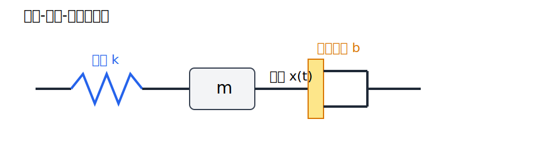
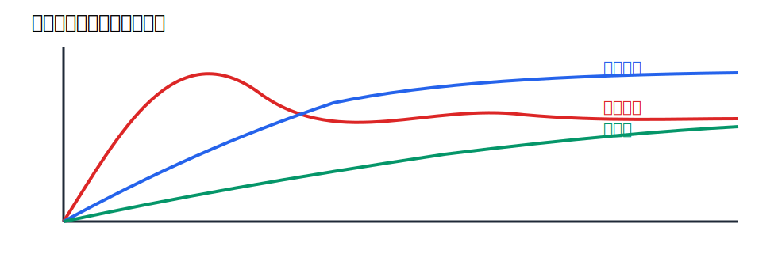
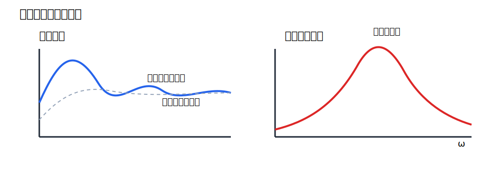

# 補足講義 ばね‐質量‐ダンパー系の減衰振動と強制振動

## 1. 導入

第4回では時間応答を、主として標準的な一次系・二次系の観点から整理した。ここではその背後にある具体的な物理モデルとして、ばね‐質量‐ダンパー系を取り上げる。これは機械振動、車両サスペンション、除振台、建築の制振など、多くの工学系の原型である。

この補足の目的は次の3つである。

- 減衰振動を、ばね‐質量‐ダンパー系の運動方程式から理解する
- 強制振動を導入し、定常振動・共振・位相遅れの意味を押さえる
- Node.js で自分で数値シミュレーションし、式と波形の対応を確かめる

## 2. ばね‐質量‐ダンパー系

質量 $m$ の物体に、ばね定数 $k$ のばねと、速度に比例する抵抗係数 $b$ のダンパーが接続されているとする。変位を $x(t)$ とすると、自由振動では運動方程式は

$$
m\ddot{x}+b\dot{x}+kx=0
$$

である。

ここで

$$
\omega_0=\sqrt{\frac{k}{m}}, \qquad \gamma=\frac{b}{2m}
$$

を導入すると、

$$
\ddot{x}+2\gamma \dot{x}+\omega_0^2 x=0
$$

と書ける。



この図では、ばねが復元力、ダンパーが散逸、質量が慣性を担当している。第3回で見た二次系の標準形は、この具体的な物理系に直接対応している。

## 3. 減衰振動

特性方程式は

$$
\lambda^2+2\gamma\lambda+\omega_0^2=0
$$

であり、その解は

$$
\lambda=-\gamma\pm\sqrt{\gamma^2-\omega_0^2}
$$

である。したがって、減衰の種類は $\gamma$ と $\omega_0$ の大小関係で分かれる。

### 3.1 不足減衰

$$
\gamma<\omega_0
$$

のとき、

$$
\omega_d=\sqrt{\omega_0^2-\gamma^2}
$$

とおけば、

$$
x(t)=A e^{-\gamma t}\cos(\omega_d t+\alpha)
$$

となる。振動しながら包絡線

$$
e^{-\gamma t}
$$

で減衰する。

### 3.2 臨界減衰

$$
\gamma=\omega_0
$$

のとき、

$$
x(t)=(c_1+c_2 t)e^{-\gamma t}
$$

となる。振動せず、しかも過減衰より速く零へ向かう境界的な場合である。

### 3.3 過減衰

$$
\gamma>\omega_0
$$

のとき、

$$
\eta=\sqrt{\gamma^2-\omega_0^2}
$$

として

$$
x(t)=e^{-\gamma t}\left(c_1 e^{\eta t}+c_2 e^{-\eta t}\right)
$$

となる。振動はしないが、一般には臨界減衰より応答が遅い。



この図は、同じ二次系でも減衰の強さによって波形の見え方が変わることを示している。時間応答の授業で扱った「振動的」「非振動的」は、ここでは具体的な力学モデルとして現れている。

## 4. 強制振動

外力

$$
f(t)=F_0 \sin \omega t
$$

が加わると、運動方程式は

$$
m\ddot{x}+b\dot{x}+kx=F_0\sin\omega t
$$

となる。

解は

$$
x(t)=x_h(t)+x_p(t)
$$

と分けられる。ここで $x_h(t)$ は同次方程式の解であり、減衰により消えていく過渡成分である。$x_p(t)$ は外力と同じ角振動数をもつ特解で、十分時間が経った後に残る定常成分である。

定常解を

$$
x_p(t)=X(\omega)\sin(\omega t-\phi)
$$

とおくと、振幅 $X(\omega)$ は

$$
X(\omega)=\frac{F_0}{\sqrt{(k-m\omega^2)^2+(b\omega)^2}}
$$

で与えられる。また位相遅れ $\phi$ は

$$
\tan\phi=\frac{b\omega}{k-m\omega^2}
$$

で決まる。

この式から重要なことが分かる。

- 外力の周波数 $\omega$ が変わると振幅も変わる
- 減衰 $b$ が小さいと、ある周波数帯で大きな応答が出やすい
- 応答は入力と同相ではなく、周波数とともに位相が遅れる

### 4.1 共振

減衰が小さいとき、外力の周波数が固有角周波数に近づくと応答振幅が大きくなる。これが共振である。減衰が全くなければ理想化のもとで振幅は非常に大きくなりうる。実際の設計では、この共振ピークをどう抑えるかが重要になる。



この図では、左に減衰によって消える過渡成分と残留する定常成分、右に周波数に対する振幅のピークを模式的に描いている。時間応答と周波数応答の橋渡しとして読むと理解しやすい。

## 5. Node.js によるシミュレーション

補足として、Node.js でばね‐質量‐ダンパー系を数値積分するスクリプトを追加した。

[spring_mass_damper_sim.js](/c:/srcjs/robust_control_theory/01_classical/simulations/spring_mass_damper_sim.js)

このスクリプトは、次の運動方程式を 4 次の Runge-Kutta 法で積分する。

$$
m\ddot{x}+b\dot{x}+kx=F_0\sin(\omega t+\phi)
$$

### 5.1 できること

- 自由減衰振動の計算
- 強制振動の計算
- 時刻、変位、速度、加速度の CSV 出力
- 変位波形の SVG 出力

### 5.2 実行例

自由減衰振動の例:

```bash
node 01_classical/simulations/spring_mass_damper_sim.js ^
  --mode free ^
  --m 1 --b 0.6 --k 9 ^
  --x0 1 --v0 0 ^
  --duration 20 --dt 0.01 ^
  --out 01_classical/simulations/out/free_case
```

強制振動の例:

```bash
node 01_classical/simulations/spring_mass_damper_sim.js ^
  --mode forced ^
  --m 1 --b 0.4 --k 9 ^
  --F0 1 --omega 2.8 ^
  --x0 0 --v0 0 ^
  --duration 30 --dt 0.01 ^
  --out 01_classical/simulations/out/forced_case
```

出力として

- `free_case.csv`
- `free_case.svg`

のようなファイルが生成される。

### 5.3 学習の見どころ

- $b$ を変えて不足減衰、臨界減衰、過減衰を見比べる
- $\omega$ を変えて共振付近で応答がどう変わるかを見る
- 初期条件の影響が過渡成分としてどう消えるかを見る

## 6. 演習問題

### 問1（★）

$$
m\ddot{x}+b\dot{x}+kx=0
$$

において、

$$
\omega_0=\sqrt{\frac{k}{m}},\qquad \gamma=\frac{b}{2m}
$$

を用いて式を書き換えよ。

### 問2（★★）

不足減衰の場合に解が

$$
x(t)=A e^{-\gamma t}\cos(\omega_d t+\alpha)
$$

の形になる理由を、特性方程式の根の形から説明せよ。

### 問3（★★）

強制振動

$$
m\ddot{x}+b\dot{x}+kx=F_0\sin\omega t
$$

において、長時間後に過渡成分が目立たなくなる理由を説明せよ。

### 問4（★★★）

振幅

$$
X(\omega)=\frac{F_0}{\sqrt{(k-m\omega^2)^2+(b\omega)^2}}
$$

から、減衰 $b$ が小さいほど共振ピークが鋭くなることを説明せよ。

## 7. 演習解答解説

### 問1 解答

元の式を $m$ で割ると

$$
\ddot{x}+\frac{b}{m}\dot{x}+\frac{k}{m}x=0
$$

である。ここで

$$
\frac{b}{m}=2\gamma,\qquad \frac{k}{m}=\omega_0^2
$$

だから、

$$
\ddot{x}+2\gamma\dot{x}+\omega_0^2 x=0
$$

を得る。

### 問2 解答

特性方程式は

$$
\lambda^2+2\gamma\lambda+\omega_0^2=0
$$

であり、不足減衰では

$$
\gamma<\omega_0
$$

だから判別式が負になる。したがって根は

$$
\lambda=-\gamma\pm j\omega_d
$$

の複素共役対となる。よって時間応答は

$$
e^{-\gamma t}\cos(\omega_d t),\qquad e^{-\gamma t}\sin(\omega_d t)
$$

の線形結合となり、

$$
x(t)=A e^{-\gamma t}\cos(\omega_d t+\alpha)
$$

とまとめられる。

### 問3 解答

全解は同次解と特解の和である。減衰があるので同次解の中の過渡成分には

$$
e^{-\gamma t}
$$

のような減衰因子が含まれる。したがって時間が経つと同次解は小さくなり、外力と同じ周波数をもつ特解だけが目立つようになる。

### 問4 解答

振幅は分母

$$
\sqrt{(k-m\omega^2)^2+(b\omega)^2}
$$

が小さいときに大きくなる。$b$ が小さいと第2項

$$
(b\omega)^2
$$

が小さくなり、特に

$$
k-m\omega^2\approx 0
$$

となる周波数の近くで分母が非常に小さくなりやすい。したがってピークが高く鋭くなる。

## 8. まとめ

- ばね‐質量‐ダンパー系は、二次系時間応答の代表的な物理モデルである
- 自由振動では減衰の強さに応じて不足減衰、臨界減衰、過減衰に分かれる
- 強制振動では、過渡成分と定常成分、共振、位相遅れが重要になる
- Node.js シミュレーションを使うと、式と波形の対応を自分で確かめられる

## 9. 参考

- 金沢工業大学 W3E, 「減衰振動」: https://w3e.kanazawa-it.ac.jp/math/physics/category/mechanics/masspoint_mechanics/damped_harmonic_motion/henkan-tex.cgi?target=%2Fmath%2Fphysics%2Fcategory%2Fmechanics%2Fmasspoint_mechanics%2Fdamped_harmonic_motion%2Fdamped_harmonic_motion.html
- 金沢工業大学 W3E, 「減衰振動：ばね‐質量‐ダンパー系」: https://w3e.kanazawa-it.ac.jp/math/physics/category/mechanics/masspoint_mechanics/damped_harmonic_motion/henkan-tex.cgi?target=%2Fmath%2Fphysics%2Fcategory%2Fmechanics%2Fmasspoint_mechanics%2Fdamped_harmonic_motion%2Fdphm_spring-mass-damper.html
- 金沢工業大学 W3E, 「減衰振動（ばね‐質量‐ダンパー系）：シミュレーション」: https://w3e.kanazawa-it.ac.jp/math/physics/category/simulation/damped_harmonic_motion/henkan-tex.cgi?target=%2Fmath%2Fphysics%2Fcategory%2Fsimulation%2Fdamped_harmonic_motion%2Fdamped_harmonic_motion.html
- 金沢工業大学 W3E, 「シミュレーション」: https://w3e.kanazawa-it.ac.jp/math/physics/category/simulation/henkan-tex.cgi?target=%2Fmath%2Fphysics%2Fcategory%2Fsimulation%2Findex.html
